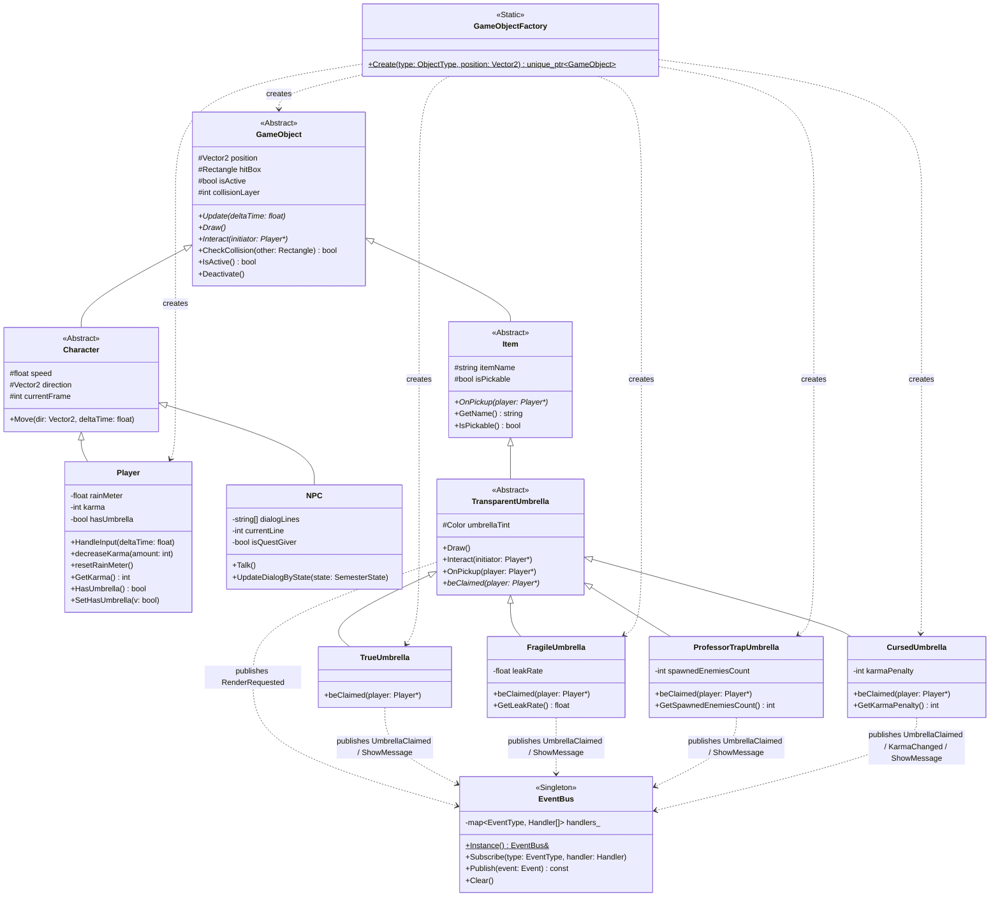
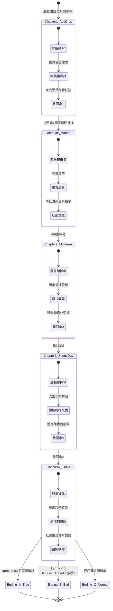
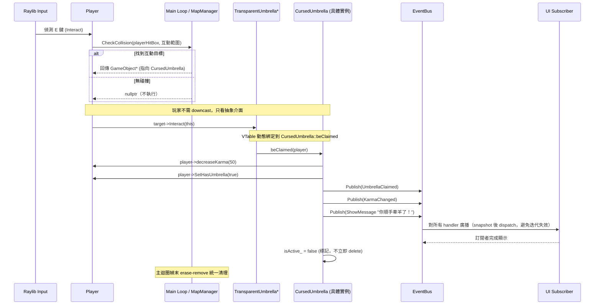

# 《尋傘記：政大山下篇》UML 設計文件

本檔聚焦 Assignment 5 評分項目 #7「UML Class Diagram」，並附上系統的狀態機與循序圖以呈現完整動態行為。所有圖以 Mermaid 撰寫，可在 GitHub / VS Code / Typora 直接渲染。

> **圖例標記**
> - 類別後加 `[v]` 表示已在 `include/` + `src/` 內實作
> - 類別後加 `[plan]` 表示僅存於設計文件、待後續開發

---

## 1. Class Diagram（類別圖）

### 實作狀態總表

| 類別 | 狀態 | 檔案 |
|---|---|---|
| `GameObject` | [v] | `include/GameObject.h` |
| `Character` | [v] | `include/Character.h` |
| `Item` | [v] | `include/Item.h` |
| `Player` | [v] | `include/Player.h` + `src/Player.cpp` |
| `NPC` | [plan] | — |
| `TransparentUmbrella` | [v] | `include/TransparentUmbrella.h` + `src/TransparentUmbrella.cpp` |
| `TrueUmbrella` | [v] | `include/TrueUmbrella.h` + `src/TrueUmbrella.cpp` |
| `FragileUmbrella` | [v] | `include/FragileUmbrella.h` + `src/FragileUmbrella.cpp` |
| `ProfessorTrapUmbrella` | [v] | `include/ProfessorTrapUmbrella.h` + `src/ProfessorTrapUmbrella.cpp` |
| `CursedUmbrella` | [v] | `include/CursedUmbrella.h` + `src/CursedUmbrella.cpp` |
| `GameObjectFactory` | [v] | `include/GameObjectFactory.h` + `src/GameObjectFactory.cpp` |
| `EventBus` | [v] | `include/EventBus.h` + `src/EventBus.cpp` |

### GoF 設計模式對照

| 模式 | 落點 | 角色 |
|---|---|---|
| **Factory Method** | `GameObjectFactory::Create` | 由 `ObjectType` 列舉動態產生 5 種具體 GameObject |
| **Template Method** | `TransparentUmbrella::beClaimed` (純虛) | 4 個子類提供 4 種被拾取行為 |
| **Observer** | `EventBus::Subscribe` / `Publish` | UI 訂閱 `RenderRequested`、`ShowMessage`、`UmbrellaClaimed` |
| **State** | `SemesterStateMachine` (規劃中) | 學期 5 章 + 3 結局之間的轉換 |

### 架構鐵律

1. `Player` 不得 `#include` 任何具體 umbrella header — 只認 `TransparentUmbrella*`
2. `Item` / `TransparentUmbrella` 不得呼叫 `DrawText` / `DrawTexture` — 一律經 `EventBus` 廣播
3. 主迴圈不得在迭代中 `delete` GameObject — 改 `isActive_ = false`，幀末 `erase-remove` 一次掃除

---

## 2. State Diagram（學期狀態機）

---

## 3. Sequence Diagram（互動循序圖）

展示玩家按下 `E` 鍵與透明傘互動時，多型動態綁定 + Observer 解耦如何協作。

---

## 4. 設計原則總結

| 原則 | 體現位置 |
|---|---|
| **針對介面寫程式** | `Player` 只持有 `TransparentUmbrella*`，永不 `#include` 具體傘類 |
| **單一職責** | `Item` / `Umbrella` 只管邏輯，渲染丟給 `EventBus` 訂閱者 |
| **開放封閉** | 新增「會飛的傘」只需加一個 `TransparentUmbrella` 子類 + Factory enum，主迴圈零修改 |
| **記憶體安全** | 物件以 `std::unique_ptr` 持有；移除採 `isActive_` 旗標 + 幀末 `erase-remove` |
