# 《尋傘記：政大山下篇》UML 設計文件

本檔為《尋傘記》(C++20 / Raylib 5.5，俯視角敘事 RPG) 的系統架構與 UML 分析。它聚焦
Assignment 5 評分項目 #7「UML Class Diagram」，並隨程式碼演進更新到目前的實作
（含正在為 Assignment #6「吸血鬼倖存者」生存玩法鋪路的 ISystem 模擬管線與 `IMortal`
角色介面）。所有圖以 Mermaid 撰寫；每張圖刻意拆到 ≤ 8 個類別以符合 GitHub 的
Mermaid 渲染上限。**若你的 GitHub 仍對某張圖顯示「資訊過多無法渲染」**，有三個解法：
(1) 把該圖的 ` ```mermaid ` 原始碼貼到 <https://mermaid.live> 直接檢視／匯出圖片；
(2) 在本機以 mermaid-cli 預先渲染成圖片再內嵌：
`npx -y @mermaid-js/mermaid-cli -i docs/UML.md -o docs/uml.svg`；
(3) 用 VS Code 的 Markdown Preview Mermaid 外掛（離線即可渲染，不受 GitHub 上限限制）。

> **為什麼把類別圖拆成好幾張？**
> 早期版本把約 40 個類別塞進「一張」`classDiagram`。Mermaid／GitHub 會把整張圖
> 等比縮到版面寬度，類別一多就被縮到看不清字（這就是「拉遠後全部變超小」的問題）。
> 本檔改成 **先一張頂層「層次地圖」flowchart 說明分層依賴，再每一層各一張小類別圖**
> （每張 ≤ 約 12 個類別），如此每張圖都能以可讀的尺寸渲染。GitHub 對每張 Mermaid
> 圖都提供點擊放大（zoom），所以需要看細節時再點開即可。

> **圖例**：`<<Abstract>>` 抽象基底、`<<interface>>` 角色／服務介面、`<<enumeration>>`
> 列舉、`<<Singleton>>` 單例、`<<Factory>>` 工廠。方法後 `*` 代表純虛擬。

---

## 0. 層次地圖（Layer Map）

程式碼以資料夾分層（`include/` 與 `src/` 同構），對應 MVC 與其周邊服務。下圖只畫
「層與層之間的依賴方向」，每一層內部的類別圖見對應章節。核心鐵律：**Model（World／
entities）不認得 raylib 或輸入**；**View 只讀模型、只輸出畫面**；**Controller 收輸入、
跑模擬、接事件**；`main.cpp` 是薄薄的組裝根（composition root）。

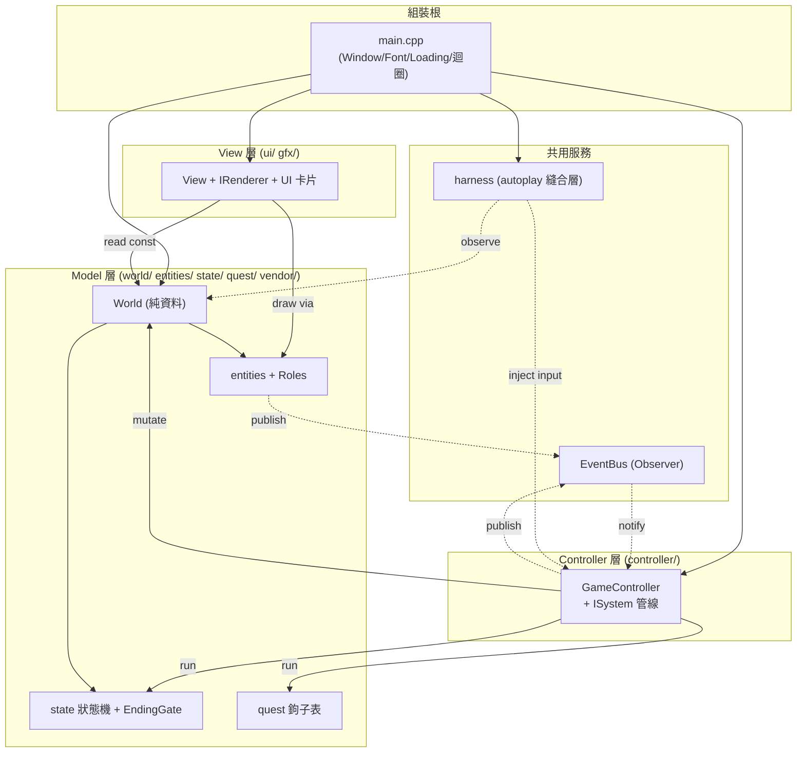

層與其類別圖對照：

| 層 | 章節 | 主要資料夾 |
|---|---|---|
| 實體與道具繼承樹 | §1 | `include/game/entities/`、`include/engine/core/` |
| 狀態機與結局 | §2 | `include/game/state/` |
| MVC 核心 + ISystem 模擬管線 | §3 | `include/game/world/`、`include/game/controller/`、`include/ui/View.h` |
| gfx 繪圖層 | §4 | `include/game/gfx/`、`include/engine/render/`、`include/ui/` |
| autoplay 縫合層 | §5 | `include/engine/platform/`（Harness/ScriptInput/Time） |

---

## 1. 實體與道具繼承樹（Entities & Items）

地圖上每個會動／不會動的東西都是一個 `GameObject`。重點是 **介面隔離原則 (ISP)**：
`GameObject` 不再用三個「胖純虛擬」(Update/Render/Interact) 強迫每個葉類別實作空殼，
而是把能力拆成獨立角色介面 `IUpdatable` / `IDrawable` / `IInteractable` / `IMortal`，
由 CRTP mixin `WithRoles<Derived,Base>` 在 **編譯期** 靜態判斷某型別扮演哪些角色並回傳
typed pointer（`AsUpdatable` / `AsDrawable` / `AsInteractable` / `AsMortal`），全程無
`dynamic_cast`。`IMortal`（hp / `TakeDamage` / `IsDead`）是 Assignment #6 戰鬥的鋪路，
目前只有 `Player` 扮演。

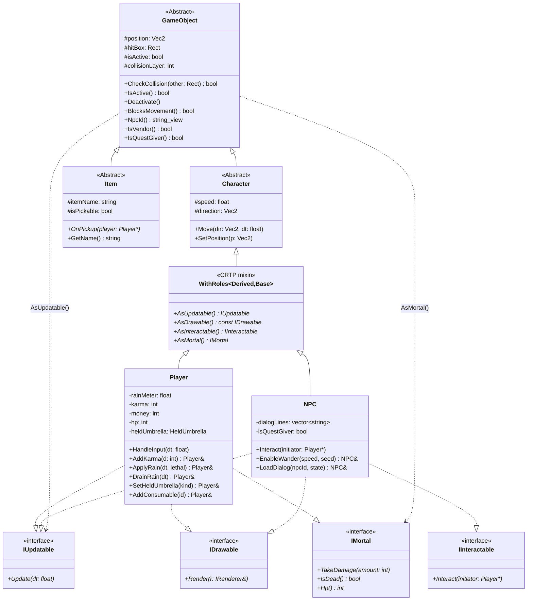

> 註：上圖把 `WithRoles<Derived,Base>` 畫成 `Character` 的子類別以表達「插在中間層」
> 的繼承位置；實際上它是 `template<class Derived, class Base> class WithRoles : public Base`，
> `Base` 是 `Character` / `Item` / `ConsumableItem` / `TransparentUmbrella` 之一。

### 1a. 道具子樹（傘、消耗品、撿取物、看板）

5 把傘共用同一個 `TransparentUmbrella` 抽象基底，外觀靠 `UmbrellaStyle` 區分（Domed /
Broken / Spiked / Drooping），但各自覆寫純虛擬 `BeClaimed()` 帶來不同後果——這是
**Template Method**。`ProfessorTrapUmbrella` 是第 5 把「陷阱傘」（非企劃原四把之一）。
消耗品 `ConsumableItem` 同樣是中間層，多型動詞改為 `Consume()`（在「使用」時才生效，
撿起只入袋）。`DlcSign` 刻意直接掛在 `GameObject` 下（它不是可撿的 `Item`）。

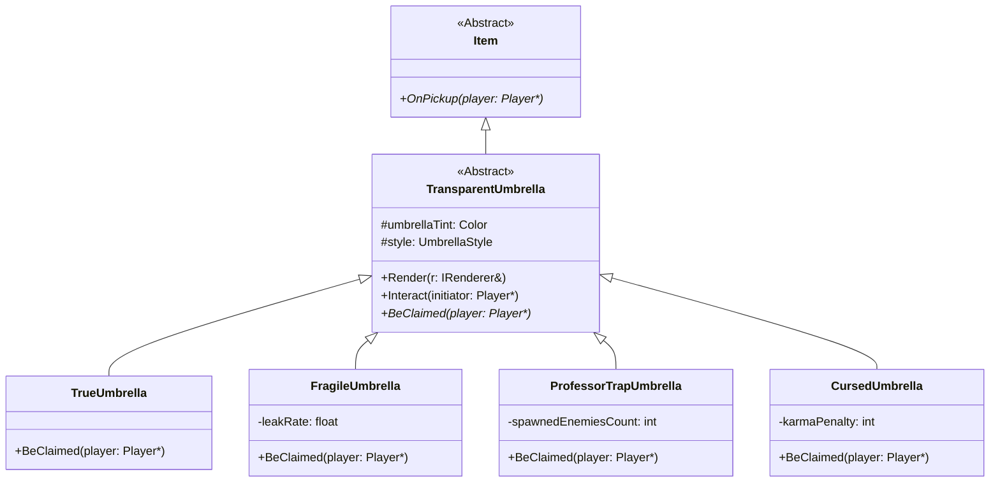

消耗品（中間層 `ConsumableItem`，多型動詞 `Consume()`）、撿取物與看板另成一張（同樣掛在 `Item` 下，`DlcSign` 例外直接掛 `GameObject`）：

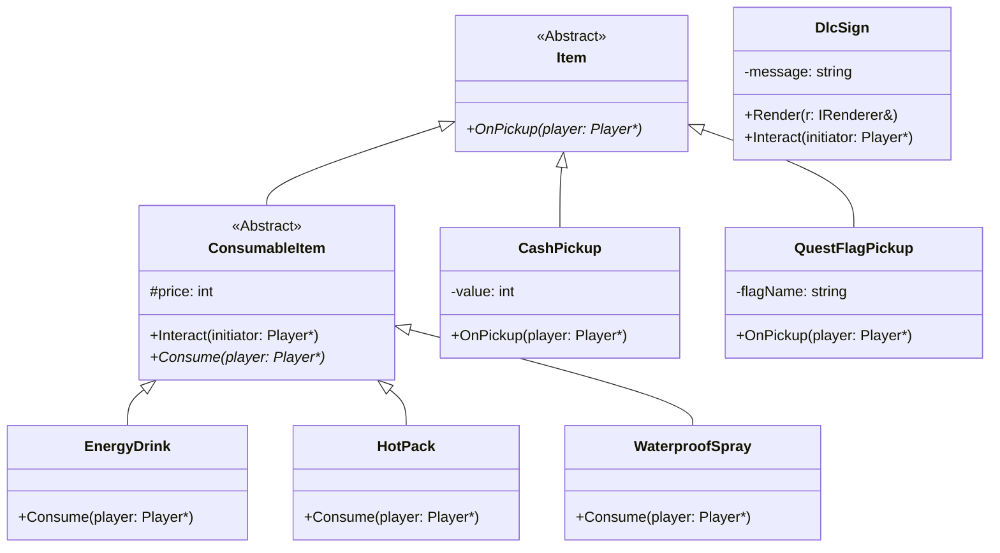

> 上圖省略每個葉類別頭上的 `WithRoles` mixin 與 `IDrawable`/`IInteractable` 介面線以保持
> 可讀；它們的角色組合是：傘＝`IDrawable`+`IInteractable`；消耗品＝`IInteractable`；
> `CashPickup`/`QuestFlagPickup`/`DlcSign`＝`IDrawable`+`IInteractable`。`Vendor`
> 繼承 `NPC`（見 §3）。

### 實作狀態總表

| 類別 | 檔案 |
|---|---|
| `GameObject` / `Character` / `Item` | `include/engine/core/GameObject.h`、`include/game/entities/{Character,Item}.h` |
| `Roles.h`（`IUpdatable`/`IDrawable`/`IInteractable`/`IMortal`/`WithRoles`/`ForEachRole`） | `include/engine/core/Roles.h` |
| `Player` | `include/game/entities/Player.h` + `src/game/entities/Player.cpp` |
| `NPC` | `include/game/entities/NPC.h` + `src/game/entities/NPC.cpp` |
| `TransparentUmbrella` + 4 葉類別 | `include/game/entities/{TransparentUmbrella,TrueUmbrella,FragileUmbrella,ProfessorTrapUmbrella,CursedUmbrella}.h` |
| `ConsumableItem` + 3 葉類別 | `include/game/entities/{ConsumableItem,EnergyDrink,HotPack,WaterproofSpray}.h` |
| `CashPickup` / `QuestFlagPickup` / `DlcSign` | `include/game/entities/{CashPickup,QuestFlagPickup,DlcSign}.h` |
| `GameObjectFactory`（`ObjectType` 列舉 → 12 種） | `include/game/controller/GameObjectFactory.h` + `src/game/controller/GameObjectFactory.cpp` |

---

## 2. 狀態機與結局（State machine & Endings）

學期進程由 `SemesterStateMachine` 驅動。每個章節是一個 `IChapterState`（State 模式）：
切換時 `Transition()` 重建一個具體狀態物件。結局**不是** `IChapterState` 子類別——機器
以 `ending_` / `inEnding_` 哨兵記錄結局態。結局判定集中在自由函式 `CheckEndingGates()`
（`EndingGate.cpp`），每個非對話幀輪詢一次。

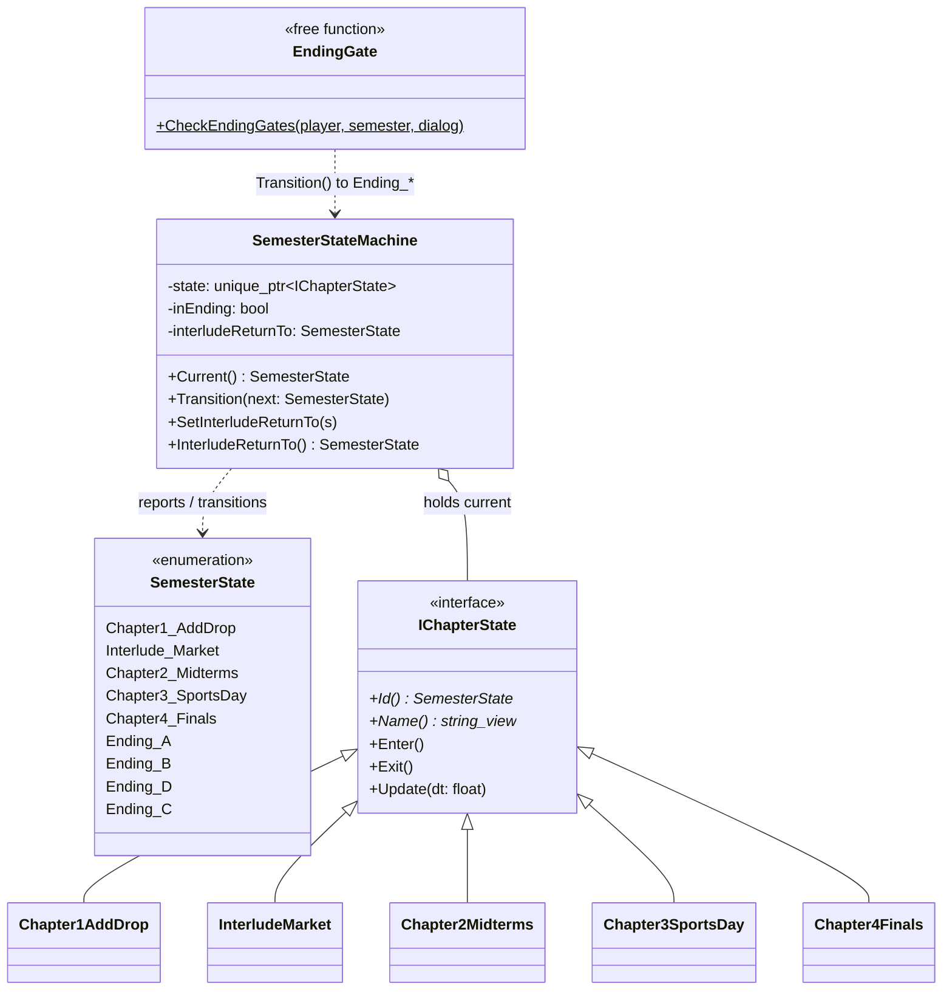

### 2a. 學期狀態圖（4 結局 A → B → D → C）

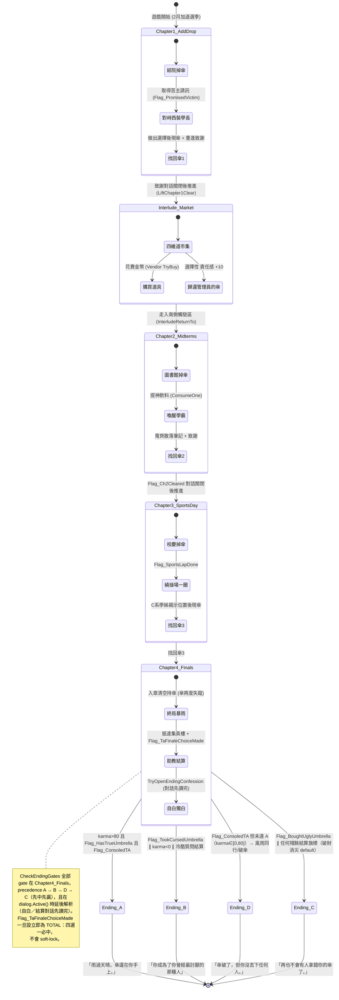

> **相對舊版的改動**：新增第四個結局 **Ending_D 風雨同行**（選了「體諒」但 karma≤80 →
> `FragileBroken` 破傘）。結局判定不再只掛在對話確認當下，而是每個非對話幀輪詢
> `CheckEndingGates`；舊的「Ch1 買醜傘 → C」sibling-if 已移除，真正的 C 觸發點改為
> Ch4 集英樓便利商店的 `Vendor`（設 `Flag_BoughtUglyUmbrella`）。詳見
> `src/game/state/EndingGate.cpp`。

---

## 3. MVC 核心 + ISystem 模擬管線

`World` 是純資料模型（擁有每個 `GameObject`、學期 FSM、建築追蹤、地形碰撞遮罩、對話狀態、
HUD／選單／背包等 UI 狀態），無 raylib、無輸入。`GameController` 收輸入、跑模擬、接事件——
**這次最大的結構改變**：原本約 793 行的 `Update()` god-method 已拆成一條
**`ISystem` 模擬管線**（`SimSystem.h` / `SimSystems.cpp`）。每個 stage 只負責一件事，由
Controller 以固定順序執行，並透過 `SimContext` 串接。這正是 Assignment #6 生存遊戲所需的
可重用 model 端 stage（`CollisionSystem` + `SpawnSystem` 即未來的 Spawner），現在升格為
一等公民型別。E 互動的任務副作用則改用 **資料化的 `QuestHookTable`**（`RunInteractHooks`）
取代約 14 個內嵌 `TryXxx` 呼叫（OCP）。

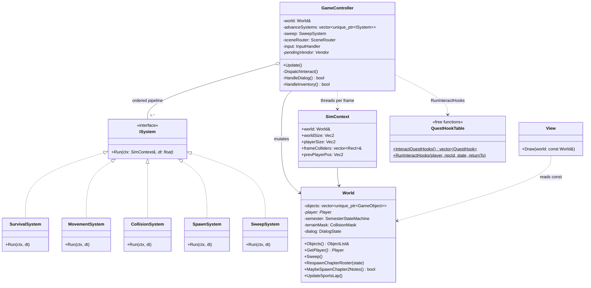

### 3a. 周邊服務：EventBus、Vendor、Controller 子助手

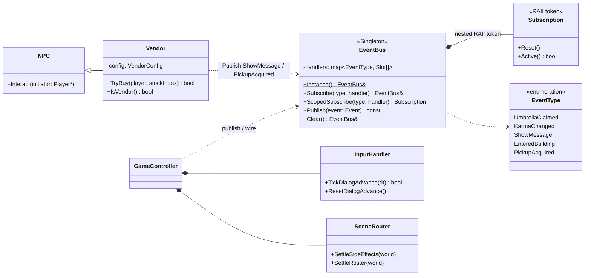

> **已知技術債（誠實標註）**：`View::Draw` 仍是一個龐大的單體 renderer（深度排序所有
> 物件＋建築＋裝飾、HUD、對話框、結局畫面、選單皆在其中）；目前透過抽出 `EndingView` /
> `ChapterCard` / `HelpPageView` / `InventoryView` / `MessageView` 等自由函式緩解，但
> `View.cpp` 本體仍偏大。`EventBus` 的 `shared_mutex` 只保護 handler list，handler 本體
> 仍不可跨執行緒 publish（GL 單執行緒）——見 BUGLEDGER H1。

---

## 4. gfx 繪圖層（IRenderer + 角色卡片）

所有 raylib `::Draw*` 呼叫都被關在 `IRenderer` 後面：Model 端寫 `Render()` 只認
`IRenderer&`，永遠不 include raylib（架構紅線）。`RaylibRenderer` 是唯一的具體實作。
材質透過 process-lifetime 的 `TextureCache`（`Texture.h`）只上傳一次、其餘為非擁有 view。
傘的外觀有單一真相來源 `DrawUmbrellaGlyph`（純 rect 向量圖，in-world／pickup／結局卡共用）。

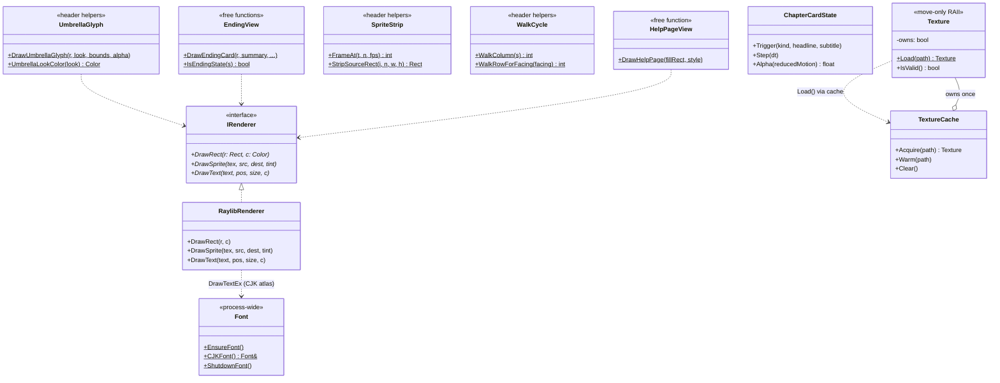

> 其他 View 端、純表現、不進 `World::Objects()` 的元件：`Decorations`（`DecorationDef`
> 動畫裝飾，依章節顯示、缺圖則不畫）、`LoadingScreen`（人類路徑暖機畫面）、
> `MessageView` / `InventoryView`（HUD 與背包繪製）。這些都不影響 autoplay 的
> `state.jsonl`（harness 只序列化 `World::Objects()`）。

---

## 5. autoplay 縫合層（Harness）

感知＋致動的縫合層：預設關閉（無 `UMBRELLA_SCRIPT` 環境變數時 `MaybeAttach()` 回傳
inactive 的 `Harness`，正常遊玩 bit-for-bit 不變）。啟用時換上 deterministic 的腳本輸入源
＋固定 timestep，每 N 幀截圖、每幀輸出一行 JSON 狀態。輸入透過單一抽象 `InputSource`
（`LiveInput` 走真實 raylib、`ScriptInput` 走腳本）；時間透過 `Time::DeltaSeconds()`
（harness 固定 1/60 步）。

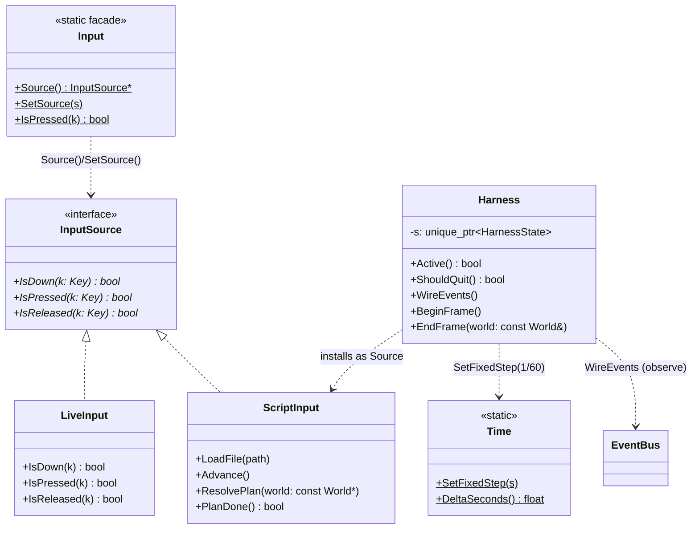

---

## 6. 系統互動：循序圖（Sequence Diagrams）

### 6a. E 互動 → 多型 BeClaimed → EventBus（保留並更新自原版）

展示玩家按 `E` 與一把未知透明傘互動時，**多型動態綁定 + Observer 解耦** 如何協作。
注意：互動偵測現在發生在 `GameController::DispatchInteract()`（E-probe reach box），
傘的具體後果由 vtable 綁定到 `CursedUmbrella::BeClaimed`，再經 `EventBus` 廣播；物件
不立即刪除，改標記 `isActive_=false`，於幀末 `World::Sweep()` 統一清除。

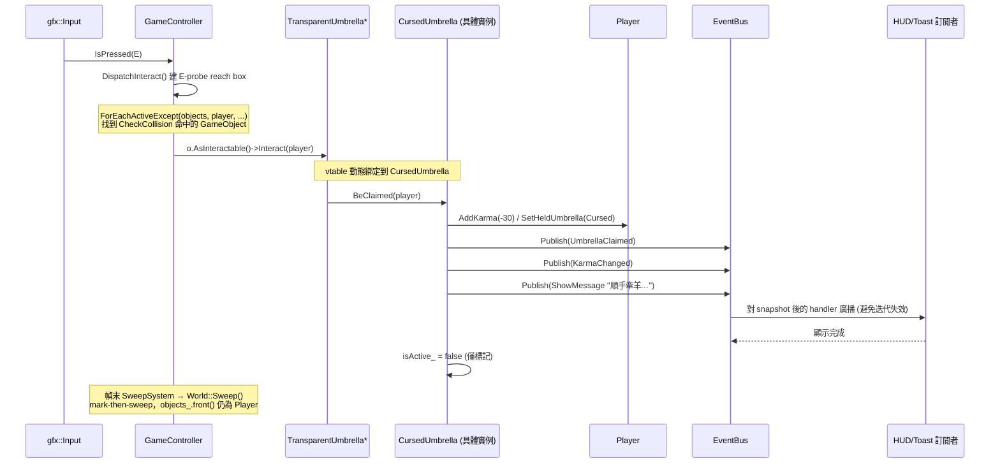

### 6b. 每幀模擬管線：GameController 依序跑 ISystem（新增）

展示一個「未凍結」幀的 model 推進順序。`SimContext` 由 `MovementSystem` 把 pre-tick 玩家
座標交給 `CollisionSystem`。`SweepSystem` 是終端 stage，在互動／結局判定之後才跑，所以
被某個 gate 標記為 dead 的物件當幀就被回收。

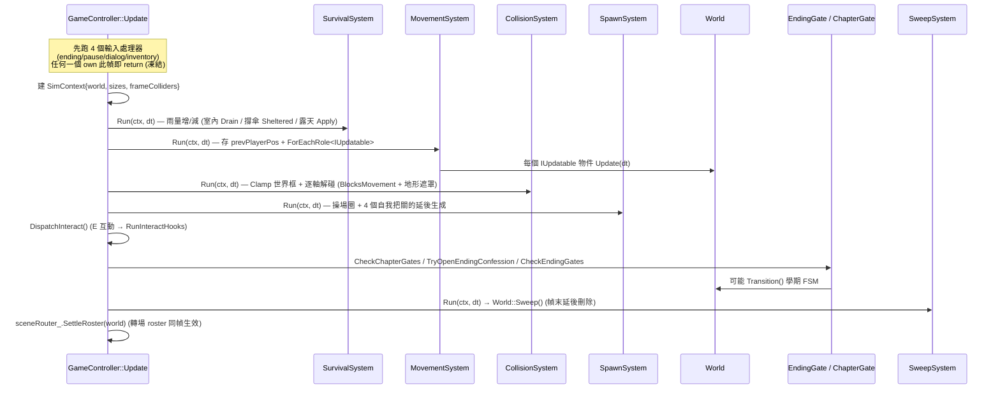

---

## 7. 設計模式對照（GoF）

| 模式 | 落點 | 角色 |
|---|---|---|
| **Factory Method** | `GameObjectFactory::Create(ObjectType, Vec2)` | 由 `ObjectType` 列舉動態產生 12 種具體 `GameObject`（4 傘 + 3 消耗品 + Vendor + 3 種金幣 + Player） |
| **Template Method** | `TransparentUmbrella::BeClaimed`（純虛）、`ConsumableItem::Consume`（純虛） | 傘的 4 子類別提供 4 種被拾取行為；消耗品 3 子類別提供 3 種使用效果 |
| **Observer** | `EventBus::Subscribe` / `ScopedSubscribe` / `Publish` | UI/HUD 訂閱 `ShowMessage`、`KarmaChanged`、`UmbrellaClaimed`、`EnteredBuilding`、`PickupAcquired`；`Subscription` 為 RAII 退訂 token (H1) |
| **State** | `SemesterStateMachine` + `IChapterState` 的 5 個具體章節狀態 | 學期 5 章 + 4 結局（結局以哨兵記錄，非狀態物件）之間的轉換 |
| **Strategy / Pipeline（新）** | `ISystem::Run` 的 5 個 stage（Survival/Movement/Collision/Spawn/Sweep），由 `GameController` 依序執行 | 把原本約 793 行 god-method 拆成可組合、可重排、可單獨測試的 model 端 stage；Assignment #6 生存玩法可直接擴充 `CollisionSystem`／加 Spawner |
| **CRTP static mixin（新）** | `WithRoles<Derived, Base>` 編譯期實作 `AsUpdatable/AsDrawable/AsInteractable/AsMortal` | 以 `std::derived_from` + `if constexpr` 取代 `dynamic_cast` 做能力查詢；ISP 角色介面的靜態分派 |
| **Singleton** | `EventBus::Instance()` | 全域事件匯流排（`shared_mutex` 僅護 handler list） |
| **Command/Table（資料化）** | `QuestHookTable`（`InteractQuestHooks` / `RunInteractHooks`） | 把 ~14 個內嵌 `TryXxx` 互動鉤子改為一張有序、自我把關的資料表（OCP：加章節＝加一行 `RegisterHook`） |

---

## 8. 設計原則總結（SOLID / 其他）

| 原則 | 體現位置 |
|---|---|
| **單一職責 (SRP)** | `World`＝純資料、`View`＝只繪圖、`GameController`＝輸入＋協調；god-method 拆成 5 個單一職責 `ISystem`、4 個 `Handle*` 輸入處理器 |
| **開放封閉 (OCP)** | 新增一把傘＝加一個 `TransparentUmbrella` 子類別 + Factory enum；新增互動鉤子＝`QuestHookTable` 加一行；新增模擬 stage＝push 一個 `ISystem`——皆不需改既有 switch |
| **里氏替換 (LSP)** | 場景容器只持 `GameObject*`，透過 `As*()` 角色存取器多型分派；`Vendor` 可替換 `NPC` |
| **介面隔離 (ISP)** | `Roles.h` 把胖介面拆成 `IUpdatable`/`IDrawable`/`IInteractable`/`IMortal`——道具不必實作 `Update`，看板不必 `IMortal` |
| **依賴反轉 (DIP)** | Model 寫 `IRenderer&` 而非具體 raylib；輸入經 `InputSource` 抽象（`LiveInput`/`ScriptInput` 可換）；`Player` 只持 `TransparentUmbrella*`，永不 include 具體傘類 |
| **針對介面寫程式** | E 互動只認 `IInteractable`，傘的具體後果靠 vtable；對話副作用經 `EventBus` 廣播而非直接呼叫 UI |
| **記憶體安全 / RAII** | 物件以 `std::unique_ptr` 持有；移除採 `isActive_` 旗標 + 幀末 `World::Sweep()` mark-then-sweep（不在迭代中刪除、`objects_.front()` 恆為 Player）；`Texture`/`Font`/`EventBus::Subscription` 皆 RAII；GL 資源在 `~Window`／`CloseWindow` 前顯式釋放 |
| **決定性 / 可重播** | harness 固定 1/60 timestep + 腳本輸入源 ⇒ 同腳本 byte-identical `state.jsonl`；正常遊玩完全不受影響（無 `UMBRELLA_SCRIPT` 即旁路） |

### 架構鐵律（紅線）

1. `Player` 不得 `#include` 任何具體 umbrella header——只認 `TransparentUmbrella*`。
2. `Item` / `TransparentUmbrella` / 任何 Model 類別不得直接呼叫 raylib `Draw*`——一律經
   注入的 `IRenderer`，或經 `EventBus` 廣播交給 View 訂閱者。
3. 主迴圈不得在迭代中 `delete` GameObject——改 `isActive_ = false`，由 `SweepSystem` →
   `World::Sweep()` 於幀末統一 erase-remove。
4. `ISystem` 只動 model（`World&` / `Player&`）——不讀輸入、不呼叫 raylib、不繪圖。
5. harness 絕不改變正常遊玩行為（已驗證 bit-for-bit 不變）。
