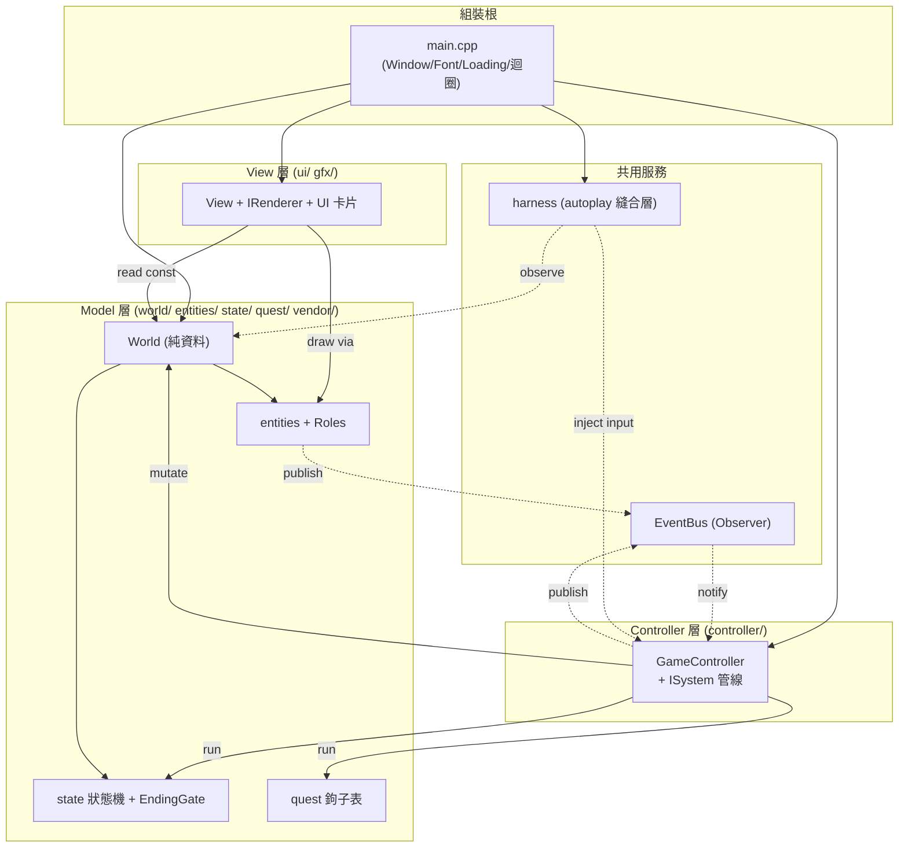

## 0. 層次地圖（Layer Map）

程式碼以資料夾分層（`include/` 與 `src/` 同構），對應 MVC 與其周邊服務。下圖只畫
「層與層之間的依賴方向」，每一層內部的類別圖見對應章節。核心鐵律：**Model（World／
entities）不認得 raylib 或輸入**；**View 只讀模型、只輸出畫面**；**Controller 收輸入、
跑模擬、接事件**；`main.cpp` 是薄薄的組裝根（composition root）。

層與其類別圖對照：

| 層 | 章節 | 主要資料夾 |
|---|---|---|
| 實體與道具繼承樹 | [§1](1-entities.md) | `include/game/entities/`、`include/engine/core/` |
| 狀態機與結局 | [§2](2-state-machine.md) | `include/game/state/` |
| MVC 核心 + ISystem 模擬管線 | [§3](3-mvc-isystem.md) | `include/game/world/`、`include/game/controller/`、`include/ui/View.h` |
| gfx 繪圖層 | [§4](4-gfx.md) | `include/game/gfx/`、`include/engine/render/`、`include/ui/` |
| autoplay 縫合層 | [§5](5-harness.md) | `include/engine/platform/`（Harness/ScriptInput/Time） |

---

[← 回 UML 總覽](README.md) ｜ [下一節：§1 實體與道具繼承樹 →](1-entities.md)
