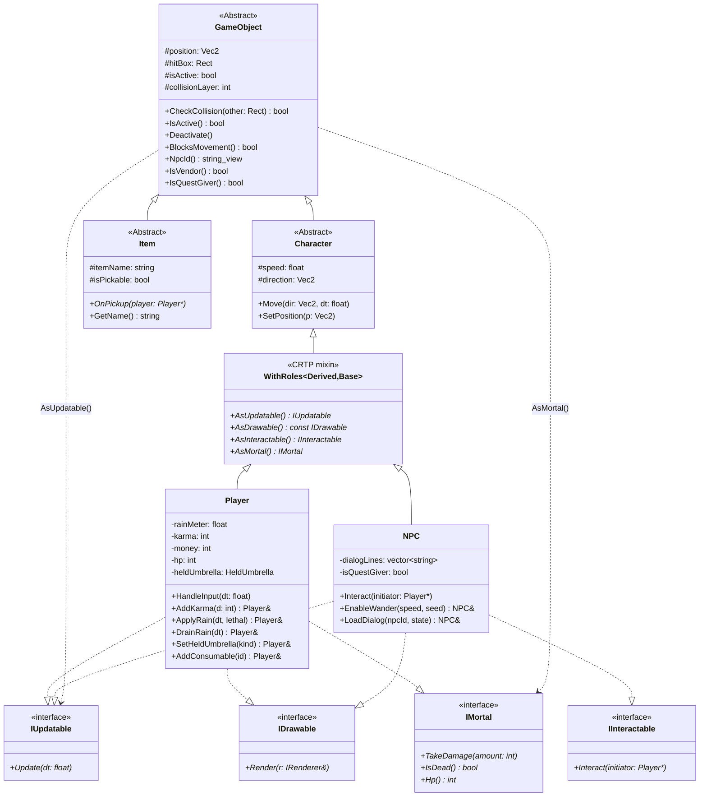
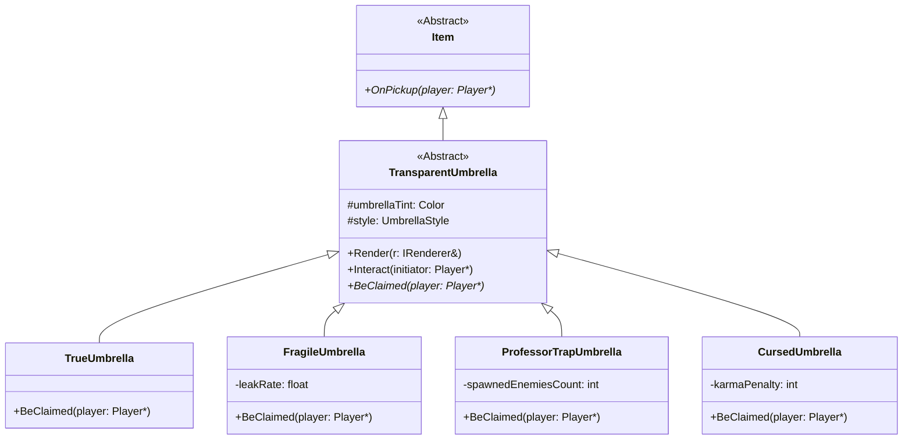
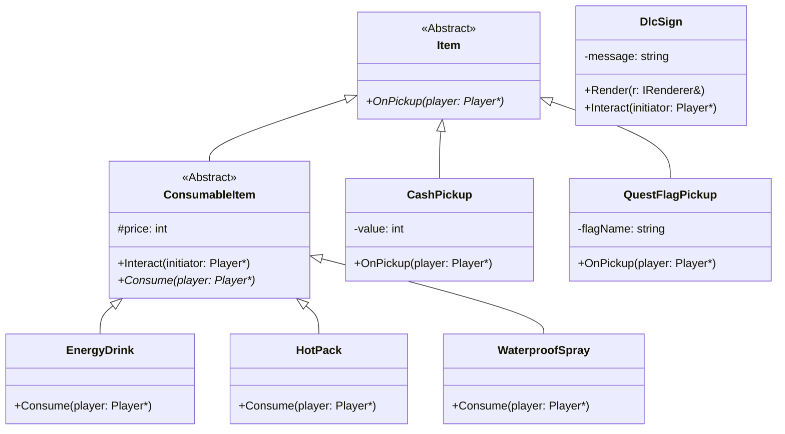

## 1. 實體與道具繼承樹（Entities & Items）

地圖上每個會動／不會動的東西都是一個 `GameObject`。重點是 **介面隔離原則 (ISP)**：
`GameObject` 不再用三個「胖純虛擬」(Update/Render/Interact) 強迫每個葉類別實作空殼，
而是把能力拆成獨立角色介面 `IUpdatable` / `IDrawable` / `IInteractable` / `IMortal`，
由 CRTP mixin `WithRoles<Derived,Base>` 在 **編譯期** 靜態判斷某型別扮演哪些角色並回傳
typed pointer（`AsUpdatable` / `AsDrawable` / `AsInteractable` / `AsMortal`），全程無
`dynamic_cast`。`IMortal`（hp / `TakeDamage` / `IsDead`）是 Assignment #6 戰鬥的鋪路，
目前只有 `Player` 扮演。

> 註：上圖把 `WithRoles<Derived,Base>` 畫成 `Character` 的子類別以表達「插在中間層」
> 的繼承位置；實際上它是 `template<class Derived, class Base> class WithRoles : public Base`，
> `Base` 是 `Character` / `Item` / `ConsumableItem` / `TransparentUmbrella` 之一。

### 1a. 道具子樹（傘、消耗品、撿取物、看板）

5 把傘共用同一個 `TransparentUmbrella` 抽象基底，外觀靠 `UmbrellaStyle` 區分（Domed /
Broken / Spiked / Drooping），但各自覆寫純虛擬 `BeClaimed()` 帶來不同後果——這是
**Template Method**。`ProfessorTrapUmbrella` 是第 5 把「陷阱傘」（非企劃原四把之一）。
消耗品 `ConsumableItem` 同樣是中間層，多型動詞改為 `Consume()`（在「使用」時才生效，
撿起只入袋）。`DlcSign` 刻意直接掛在 `GameObject` 下（它不是可撿的 `Item`）。

消耗品（中間層 `ConsumableItem`，多型動詞 `Consume()`）、撿取物與看板另成一張（同樣掛在 `Item` 下，`DlcSign` 例外直接掛 `GameObject`）：

> 上圖省略每個葉類別頭上的 `WithRoles` mixin 與 `IDrawable`/`IInteractable` 介面線以保持
> 可讀；它們的角色組合是：傘＝`IDrawable`+`IInteractable`；消耗品＝`IInteractable`；
> `CashPickup`/`QuestFlagPickup`/`DlcSign`＝`IDrawable`+`IInteractable`。`Vendor`
> 繼承 `NPC`（見 [§3](3-mvc-isystem.md)）。

### 實作狀態總表

| 類別 | 檔案 |
|---|---|
| `GameObject` / `Character` / `Item` | `include/engine/core/GameObject.h`、`include/game/entities/{Character,Item}.h` |
| `Roles.h`（`IUpdatable`/`IDrawable`/`IInteractable`/`IMortal`/`WithRoles`/`ForEachRole`） | `include/engine/core/Roles.h` |
| `Player` | `include/game/entities/Player.h` + `src/game/entities/Player.cpp` |
| `NPC` | `include/game/entities/NPC.h` + `src/game/entities/NPC.cpp` |
| `TransparentUmbrella` + 4 葉類別 | `include/game/entities/{TransparentUmbrella,TrueUmbrella,FragileUmbrella,ProfessorTrapUmbrella,CursedUmbrella}.h` |
| `ConsumableItem` + 3 葉類別 | `include/game/entities/{ConsumableItem,EnergyDrink,HotPack,WaterproofSpray}.h` |
| `CashPickup` / `QuestFlagPickup` / `DlcSign` | `include/game/entities/{CashPickup,QuestFlagPickup,DlcSign}.h` |
| `GameObjectFactory`（`ObjectType` 列舉 → 12 種） | `include/game/controller/GameObjectFactory.h` + `src/game/controller/GameObjectFactory.cpp` |

---

[← 回 UML 總覽](README.md) ｜ [上一節：§0 層次地圖](0-layer-map.md) ｜ [下一節：§2 狀態機與結局 →](2-state-machine.md)
