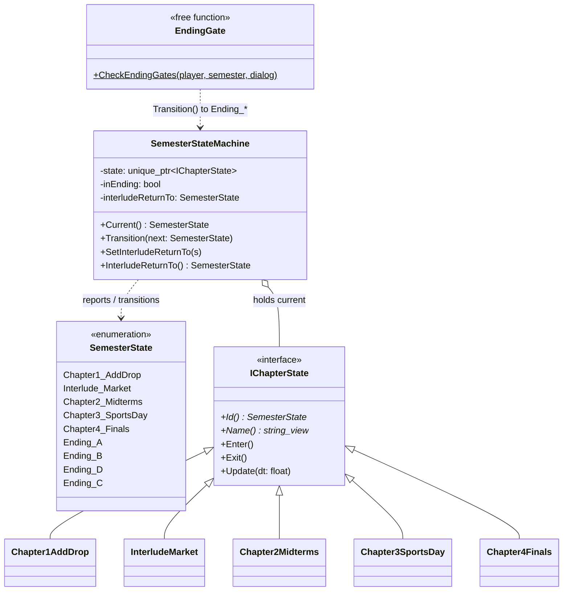
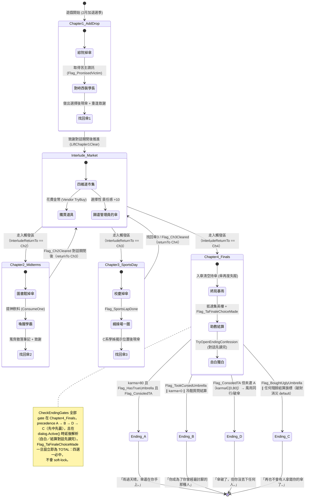

## 2. 狀態機與結局（State machine & Endings）

學期進程由 `SemesterStateMachine` 驅動。每個章節是一個 `IChapterState`（State 模式）：
切換時 `Transition()` 重建一個具體狀態物件。結局**不是** `IChapterState` 子類別——機器
以 `ending_` / `inEnding_` 哨兵記錄結局態。結局判定集中在自由函式 `CheckEndingGates()`
（`EndingGate.cpp`），每個非對話幀輪詢一次。

### 2a. 學期狀態圖（4 結局 A → B → D → C）

> **幕間市集是共用的轉運站**：每一章通關後都會先回到 `Interlude_Market`，再由
> `InterludeReturnTo` 決定下一站（Ch1→Ch2、Ch2→Ch3、Ch3→Ch4）。狀態機只有一個市集
> 狀態物件，被重複進出三次；上圖刻意畫出三條「進市集 / 出市集」的邊，與
> `ChapterGate.cpp`、`EventWiring.h` 的轉場一致（亦對應 Report §3.4 的章節脊柱）。
>
> **相對舊版的改動**：新增第四個結局 **Ending_D 風雨同行**（選了「體諒」但 karma≤80 →
> `FragileBroken` 破傘）。結局判定不再只掛在對話確認當下，而是每個非對話幀輪詢
> `CheckEndingGates`；舊的「Ch1 買醜傘 → C」sibling-if 已移除，真正的 C 觸發點改為
> Ch4 集英樓便利商店的 `Vendor`（設 `Flag_BoughtUglyUmbrella`）。詳見
> `src/game/state/EndingGate.cpp`。

---

[← 回 UML 總覽](README.md) ｜ [上一節：§1 實體與道具繼承樹](1-entities.md) ｜ [下一節：§3 MVC 核心 + ISystem 模擬管線 →](3-mvc-isystem.md)
