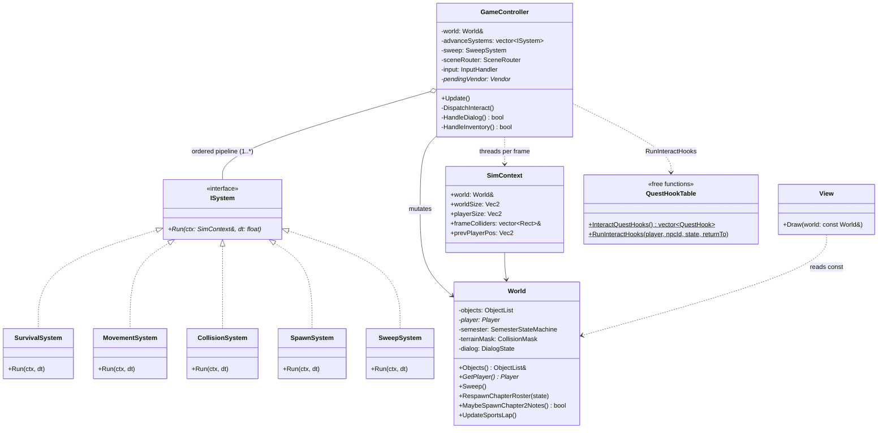
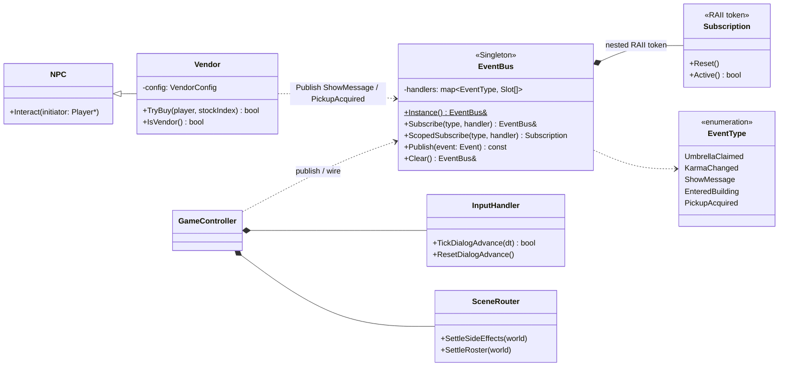

## 3. MVC 核心 + ISystem 模擬管線

`World` 是純資料模型（擁有每個 `GameObject`、學期 FSM、建築追蹤、地形碰撞遮罩、對話狀態、
HUD／選單／背包等 UI 狀態），無 raylib、無輸入。`GameController` 收輸入、跑模擬、接事件——
**這次最大的結構改變**：原本約 793 行的 `Update()` god-method 已拆成一條
**`ISystem` 模擬管線**（`SimSystem.h` / `SimSystems.cpp`）。每個 stage 只負責一件事，由
Controller 以固定順序執行，並透過 `SimContext` 串接。這正是 Assignment #6 生存遊戲所需的
可重用 model 端 stage（`CollisionSystem` + `SpawnSystem` 即未來的 Spawner），現在升格為
一等公民型別。E 互動的任務副作用則改用 **資料化的 `QuestHookTable`**（`RunInteractHooks`）
取代約 14 個內嵌 `TryXxx` 呼叫（OCP）。

### 3a. 周邊服務：EventBus、Vendor、Controller 子助手

> **已知技術債（誠實標註）**：`View::Draw` 仍是一個龐大的單體 renderer（深度排序所有
> 物件＋建築＋裝飾、HUD、對話框、結局畫面、選單皆在其中）；目前透過抽出 `EndingView` /
> `ChapterCard` / `HelpPageView` / `InventoryView` / `MessageView` 等自由函式緩解，但
> `View.cpp` 本體仍偏大。`EventBus` 的 `shared_mutex` 只保護 handler list，handler 本體
> 仍不可跨執行緒 publish（GL 單執行緒）——見 BUGLEDGER H1。

---

[← 回 UML 總覽](README.md) ｜ [上一節：§2 狀態機與結局](2-state-machine.md) ｜ [下一節：§4 gfx 繪圖層 →](4-gfx.md)
