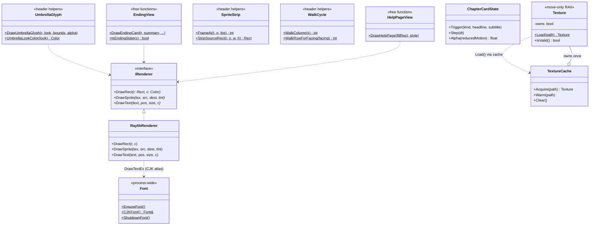

## 4. gfx 繪圖層（IRenderer + 角色卡片）

所有 raylib `::Draw*` 呼叫都被關在 `IRenderer` 後面：Model 端寫 `Render()` 只認
`IRenderer&`，永遠不 include raylib（架構紅線）。`RaylibRenderer` 是唯一的具體實作。
材質透過 process-lifetime 的 `TextureCache`（`Texture.h`）只上傳一次、其餘為非擁有 view。
傘的外觀有單一真相來源 `DrawUmbrellaGlyph`（純 rect 向量圖，in-world／pickup／結局卡共用）。

> 其他 View 端、純表現、不進 `World::Objects()` 的元件：`Decorations`（`DecorationDef`
> 動畫裝飾，依章節顯示、缺圖則不畫）、`LoadingScreen`（人類路徑暖機畫面）、
> `MessageView` / `InventoryView`（HUD 與背包繪製）。這些都不影響 autoplay 的
> `state.jsonl`（harness 只序列化 `World::Objects()`）。

---

[← 回 UML 總覽](README.md) ｜ [上一節：§3 MVC 核心 + ISystem 模擬管線](3-mvc-isystem.md) ｜ [下一節：§5 autoplay 縫合層 →](5-harness.md)
