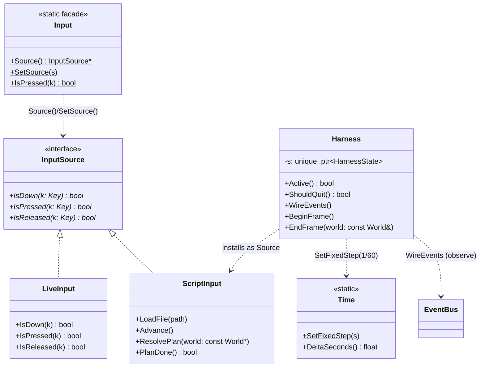

## 5. autoplay 縫合層（Harness）

感知＋致動的縫合層：預設關閉（無 `UMBRELLA_SCRIPT` 環境變數時 `MaybeAttach()` 回傳
inactive 的 `Harness`，正常遊玩 bit-for-bit 不變）。啟用時換上 deterministic 的腳本輸入源
＋固定 timestep，每 N 幀截圖、每幀輸出一行 JSON 狀態。輸入透過單一抽象 `InputSource`
（`LiveInput` 走真實 raylib、`ScriptInput` 走腳本）；時間透過 `Time::DeltaSeconds()`
（harness 固定 1/60 步）。

---

[← 回 UML 總覽](README.md) ｜ [上一節：§4 gfx 繪圖層](4-gfx.md) ｜ [下一節：§6 系統互動：循序圖 →](6-sequence.md)
