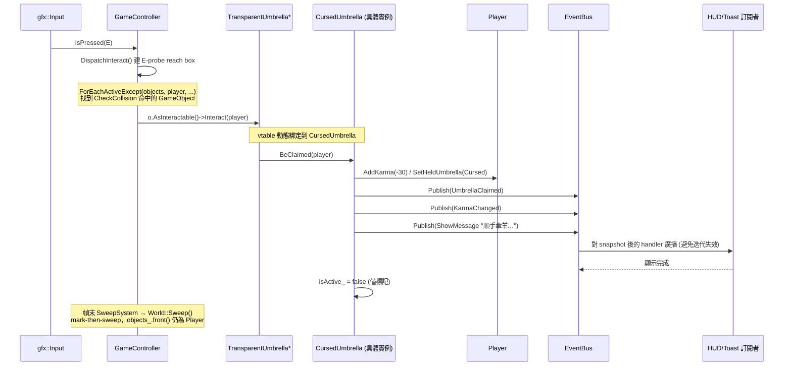
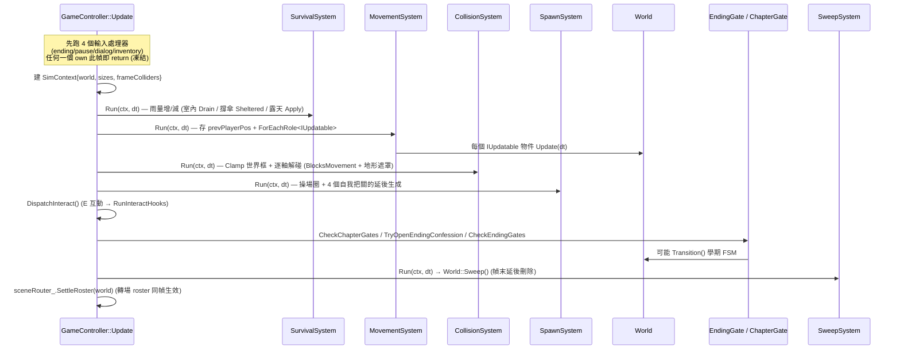

## 6. 系統互動：循序圖（Sequence Diagrams）

### 6a. E 互動 → 多型 BeClaimed → EventBus（保留並更新自原版）

展示玩家按 `E` 與一把未知透明傘互動時，**多型動態綁定 + Observer 解耦** 如何協作。
注意：互動偵測現在發生在 `GameController::DispatchInteract()`（E-probe reach box），
傘的具體後果由 vtable 綁定到 `CursedUmbrella::BeClaimed`，再經 `EventBus` 廣播；物件
不立即刪除，改標記 `isActive_=false`，於幀末 `World::Sweep()` 統一清除。

### 6b. 每幀模擬管線：GameController 依序跑 ISystem（新增）

展示一個「未凍結」幀的 model 推進順序。`SimContext` 由 `MovementSystem` 把 pre-tick 玩家
座標交給 `CollisionSystem`。`SweepSystem` 是終端 stage，在互動／結局判定之後才跑，所以
被某個 gate 標記為 dead 的物件當幀就被回收。

---

[← 回 UML 總覽](README.md) ｜ [上一節：§5 autoplay 縫合層](5-harness.md) ｜ [下一節：§7 設計模式對照（GoF） →](7-gof.md)
