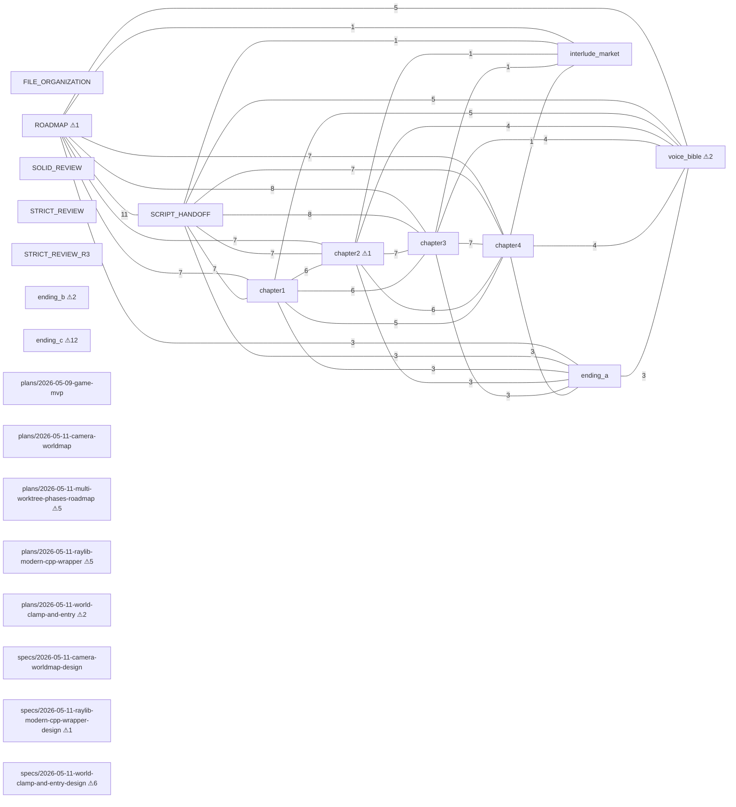

# Docs Knowledge Graph — 《尋傘記》

Domain-specific extractor (`tools/docs_graph.py`). Walks `docs/`,
parses heading tree + `Flag_*` references + NPC headings + karma
annotations + cycle8-audit conflict counts. **No LLM required**.
Replaces the abandoned `/graphify` attempt (required an LLM key).

## 1. Cross-reference graph (edges = shared `Flag_*` between files)

Node label suffix `⚠N` = N `[邏輯衝突?] Yes` items in
`cycle8-audit/<same-path>.md` summary.

## 2. Per-file stats

| File | Lines | Headings | Flags | NPCs | karma Σ (+/−) | Conflicts |
|------|-------|----------|-------|------|---------------|-----------|
| `docs/FILE_ORGANIZATION.md` | 134 | 18 | 0 | 0 | +0 (+0/+0) | — |
| `docs/ROADMAP.md` | 189 | 15 | 11 | 0 | +0 (+0/+0) | 1 |
| `docs/SCRIPT_HANDOFF.md` | 182 | 22 | 12 | 0 | +5 (+5/+0) | — |
| `docs/SOLID_REVIEW.md` | 133 | 17 | 0 | 0 | +0 (+0/+0) | 0 |
| `docs/STRICT_REVIEW.md` | 423 | 51 | 0 | 0 | +0 (+0/+0) | — |
| `docs/STRICT_REVIEW_R3.md` | 312 | 22 | 0 | 0 | +0 (+0/+0) | — |
| `docs/content/chapter1.md` | 301 | 28 | 7 | 0 | -47 (+21/-68) | 0 |
| `docs/content/chapter2.md` | 402 | 33 | 7 | 0 | -32 (+16/-48) | 1 |
| `docs/content/chapter3.md` | 357 | 40 | 8 | 0 | -1 (+19/-20) | — |
| `docs/content/chapter4.md` | 411 | 35 | 7 | 0 | +60 (+105/-45) | — |
| `docs/content/ending_a.md` | 220 | 12 | 4 | 0 | +0 (+0/+0) | 0 |
| `docs/content/ending_b.md` | 203 | 10 | 0 | 0 | +0 (+0/+0) | 2 |
| `docs/content/ending_c.md` | 167 | 12 | 0 | 0 | +0 (+0/+0) | 12 |
| `docs/content/interlude_market.md` | 396 | 59 | 2 | 0 | +0 (+0/+0) | — |
| `docs/content/voice_bible.md` | 364 | 39 | 5 | 0 | -10 (+0/-10) | 2 |
| `docs/superpowers/plans/2026-05-09-game-mvp.md` | 862 | 18 | 0 | 0 | +0 (+0/+0) | — |
| `docs/superpowers/plans/2026-05-11-camera-worldmap.md` | 680 | 19 | 0 | 0 | +0 (+0/+0) | 0 |
| `docs/superpowers/plans/2026-05-11-multi-worktree-phases-roadmap.md` | 104 | 15 | 0 | 0 | +0 (+0/+0) | 5 |
| `docs/superpowers/plans/2026-05-11-raylib-modern-cpp-wrapper.md` | 1503 | 20 | 0 | 0 | +0 (+0/+0) | 5 |
| `docs/superpowers/plans/2026-05-11-world-clamp-and-entry.md` | 1034 | 16 | 0 | 0 | +0 (+0/+0) | 2 |
| `docs/superpowers/specs/2026-05-11-camera-worldmap-design.md` | 125 | 12 | 0 | 0 | +0 (+0/+0) | 0 |
| `docs/superpowers/specs/2026-05-11-raylib-modern-cpp-wrapper-design.md` | 133 | 12 | 0 | 0 | +0 (+0/+0) | 1 |
| `docs/superpowers/specs/2026-05-11-world-clamp-and-entry-design.md` | 275 | 20 | 0 | 0 | +0 (+0/+0) | 6 |

## 3. Global flag-usage matrix

| Flag | Files using it |
|------|----------------|
| `Flag_BookwormRecovered` | ROADMAP, SCRIPT_HANDOFF, chapter3, chapter4 |
| `Flag_BoughtCoffeeForAuntie_Ch1` | ROADMAP, SCRIPT_HANDOFF, chapter1, voice_bible |
| `Flag_BoughtUglyUmbrella` | ROADMAP, SCRIPT_HANDOFF, chapter1, chapter2, chapter3, chapter4 |
| `Flag_EndingA_True` | ending_a |
| `Flag_HasProfessorTrap` | ROADMAP, SCRIPT_HANDOFF, chapter2, chapter3, chapter4, interlude_market |
| `Flag_HelpedSenior` | ROADMAP, SCRIPT_HANDOFF, chapter1, chapter2, chapter3, chapter4, ending_a, voice_bible |
| `Flag_HelpedTA_Ch1` | ROADMAP, SCRIPT_HANDOFF, chapter1, chapter2, chapter3, chapter4, ending_a, voice_bible |
| `Flag_KnowsUglyUmbrella` | SCRIPT_HANDOFF |
| `Flag_LeaveInterlude` | interlude_market |
| `Flag_PromisedVictim` | ROADMAP, SCRIPT_HANDOFF, chapter1, chapter2, chapter3, chapter4, ending_a, voice_bible |
| `Flag_SawVictim_Ch1` | ROADMAP, SCRIPT_HANDOFF |
| `Flag_ScoldedSenior` | ROADMAP, SCRIPT_HANDOFF, chapter1, chapter2, chapter3, chapter4, voice_bible |
| `Flag_TookCursedUmbrella` | ROADMAP, SCRIPT_HANDOFF, chapter1, chapter2, chapter3 |
| `Flag_xxx` | ROADMAP, SCRIPT_HANDOFF |

## 4. Karma flow summary

- Total karma annotations across `docs/content/`: **46**
- Net karma if a player triggered every annotation: **-25**
- Positive routes sum: **+166** · Negative routes sum: **-191**
- Starting karma per GDD: **50** → Ending A gate `karma > 80` requires
  **30+** net positive picks; Ending B gate `karma < 0` requires
  **−50+** net negative picks. The above totals show whether either gate
  is reachable purely via dialog karma.

## 5. Generation

`python3 tools/docs_graph.py` rewrites this file. GitHub renders the
mermaid block natively. No API key, no LLM, no external deps.
