# Text Map — 《尋傘記》 (text ↔ flag ↔ code)

Generated by `tools/text_map.py` (static, no LLM). Bridges dialogue in
`docs/content/*.md` and UI strings + branch logic in `src/`+`include/`
through the `Flag_*` they share. Touch a file and find — via the flag
table — every other file the same flag couples to.

## 1. Where the text lives

- **Dialogue (runtime-loaded `.md`)**: `docs/content/chapter1.md`, `docs/content/chapter2.md`, `docs/content/chapter3.md`, `docs/content/chapter4.md`, `docs/content/ending_a.md`, `docs/content/ending_b.md`, `docs/content/ending_c.md`, `docs/content/interlude_market.md`, `docs/content/voice_bible.md`
- **UI / system strings (compiled `.h`/`.cpp`)**: `include/controller/EventWiring.h`, `include/dialog/DialogLoader.h`, `include/dialog/DialogState.h`, `include/entities/Player.h`, `include/entities/QuestFlagPickup.h`, `include/gfx/Font.h`, `include/gfx/UmbrellaGlyph.h`, `include/quest/Chapter1Quest.h`, `include/quest/Chapter2Quest.h`, `include/quest/Chapter4Quest.h`, `include/quest/ChapterQuestItems.h`, `include/quest/NpcSpawns.h`, `include/quest/PipoyaRoster.h`, `include/quest/QuestObjective.h`, `include/state/Chapter1AddDrop.h`, `include/state/Chapter2Midterms.h`, `include/state/Chapter3SportsDay.h`, `include/state/Chapter4Finals.h`, `include/state/InterludeExitMarker.h`, `include/state/InterludeMarket.h`, `include/ui/ChapterToast.h`, `include/ui/CharacterSelect.h`, `include/ui/EndingView.h`, `include/ui/GameHelp.h`, `include/ui/InventoryView.h`, `include/vendor/Vendor.h`, `include/vendor/VendorLoader.h`, `include/vendor/VendorMessages.h`, `include/world/Buildings.h`, `include/world/Obstacles.h`, `src/controller/GameController.cpp`, `src/controller/GameObjectFactory.cpp`, `src/controller/SceneRouter.cpp`, `src/dialog/DialogLoader.cpp`, `src/dialog/DialogOpener.cpp`, `src/dialog/DialogSource.cpp`, `src/entities/CashPickup.cpp`, `src/entities/CursedUmbrella.cpp`, `src/entities/EnergyDrink.cpp`, `src/entities/FragileUmbrella.cpp`, `src/entities/HotPack.cpp`, `src/entities/Player.cpp`, `src/entities/ProfessorTrapUmbrella.cpp`, `src/entities/TransparentUmbrella.cpp`, `src/entities/TrueUmbrella.cpp`, `src/entities/WaterproofSpray.cpp`, `src/quest/Chapter1Quest.cpp`, `src/quest/Chapter2Quest.cpp`, `src/quest/Chapter3Quest.cpp`, `src/quest/ChapterVendors.cpp`, `src/quest/ItemCatalog.cpp`, `src/state/SemesterStateMachine.cpp`, `src/ui/CharacterSelect.cpp`, `src/ui/EndingView.cpp`, `src/ui/InventoryView.cpp`, `src/ui/TitleScreen.cpp`, `src/ui/View.cpp`, `src/vendor/Vendor.cpp`, `src/vendor/VendorLoader.cpp`, `src/world/World.cpp`

## 2. Flag ↔ file graph (content/code that SET ▶ flag ▶ code that READS)

```mermaid
flowchart LR
    F_Flag_Bookworm{"Flag_Bookworm"}
    S_include_quest_Chapter2Quest_h["quest/Chapter2Quest.h"]
    S_include_quest_Chapter2Quest_h --> F_Flag_Bookworm
    S_src_quest_Chapter2Quest_cpp["quest/Chapter2Quest.cpp"]
    S_src_quest_Chapter2Quest_cpp --> F_Flag_Bookworm
    R_include_quest_QuestObjective_h["quest/QuestObjective.h"]
    F_Flag_Bookworm --> R_include_quest_QuestObjective_h
    R_src_dialog_DialogOpener_cpp["dialog/DialogOpener.cpp"]
    F_Flag_Bookworm --> R_src_dialog_DialogOpener_cpp
    R_src_quest_Chapter2Quest_cpp["quest/Chapter2Quest.cpp"]
    F_Flag_Bookworm --> R_src_quest_Chapter2Quest_cpp
    R_src_world_World_cpp["world/World.cpp"]
    F_Flag_Bookworm --> R_src_world_World_cpp
    F_Flag_BookwormRecovered{"Flag_BookwormRecovered"}
    S_docs_content_chapter3_md["chapter3.md"]
    S_docs_content_chapter3_md --> F_Flag_BookwormRecovered
    S_docs_content_chapter4_md["chapter4.md"]
    S_docs_content_chapter4_md --> F_Flag_BookwormRecovered
    S_include_quest_Chapter2Quest_h --> F_Flag_BookwormRecovered
    S_src_quest_Chapter2Quest_cpp --> F_Flag_BookwormRecovered
    F_Flag_BookwormRecovered --> R_src_dialog_DialogOpener_cpp
    F_Flag_BookwormRecovered --> R_src_quest_Chapter2Quest_cpp
    R_src_quest_Chapter4Quest_cpp["quest/Chapter4Quest.cpp"]
    F_Flag_BookwormRecovered --> R_src_quest_Chapter4Quest_cpp
    F_Flag_BoughtCoffeeForAuntie_Ch1{"Flag_BoughtCoffeeForAuntie_Ch1"}
    S_docs_content_chapter1_md["chapter1.md"]
    S_docs_content_chapter1_md --> F_Flag_BoughtCoffeeForAuntie_Ch1
    S_docs_content_voice_bible_md["voice_bible.md"]
    S_docs_content_voice_bible_md --> F_Flag_BoughtCoffeeForAuntie_Ch1
    S_include_quest_Chapter4Quest_h["quest/Chapter4Quest.h"]
    S_include_quest_Chapter4Quest_h --> F_Flag_BoughtCoffeeForAuntie_Ch1
    F_Flag_BoughtCoffeeForAuntie_Ch1 --> R_src_dialog_DialogOpener_cpp
    F_Flag_BoughtCoffeeForAuntie_Ch1 --> R_src_quest_Chapter4Quest_cpp
    F_Flag_BoughtUglyUmbrella{"Flag_BoughtUglyUmbrella"}
    S_docs_content_chapter2_md["chapter2.md"]
    S_docs_content_chapter2_md --> F_Flag_BoughtUglyUmbrella
    S_docs_content_chapter3_md --> F_Flag_BoughtUglyUmbrella
    S_docs_content_chapter4_md --> F_Flag_BoughtUglyUmbrella
    S_src_quest_ChapterVendors_cpp["quest/ChapterVendors.cpp"]
    S_src_quest_ChapterVendors_cpp --> F_Flag_BoughtUglyUmbrella
    F_Flag_BoughtUglyUmbrella --> R_src_dialog_DialogOpener_cpp
    R_src_quest_ItemCatalog_cpp["quest/ItemCatalog.cpp"]
    F_Flag_BoughtUglyUmbrella --> R_src_quest_ItemCatalog_cpp
    R_src_state_EndingGate_cpp["state/EndingGate.cpp"]
    F_Flag_BoughtUglyUmbrella --> R_src_state_EndingGate_cpp
    R_src_ui_View_cpp["ui/View.cpp"]
    F_Flag_BoughtUglyUmbrella --> R_src_ui_View_cpp
    F_Flag_Ch2Cleared{"Flag_Ch2Cleared"}
    S_include_quest_Chapter2Quest_h --> F_Flag_Ch2Cleared
    S_src_quest_Chapter2Quest_cpp --> F_Flag_Ch2Cleared
    F_Flag_Ch2Cleared --> R_src_quest_Chapter2Quest_cpp
    R_src_quest_ChapterGate_cpp["quest/ChapterGate.cpp"]
    F_Flag_Ch2Cleared --> R_src_quest_ChapterGate_cpp
    F_Flag_Ch2Rippled_SuitSenior{"Flag_Ch2Rippled_SuitSenior"}
    S_include_quest_Chapter2Quest_h --> F_Flag_Ch2Rippled_SuitSenior
    S_src_quest_Chapter2Quest_cpp --> F_Flag_Ch2Rippled_SuitSenior
    F_Flag_Ch2Rippled_SuitSenior --> R_src_quest_Chapter2Quest_cpp
    F_Flag_Ch2Rippled_TA{"Flag_Ch2Rippled_TA"}
    S_include_quest_Chapter2Quest_h --> F_Flag_Ch2Rippled_TA
    S_src_quest_Chapter2Quest_cpp --> F_Flag_Ch2Rippled_TA
    F_Flag_Ch2Rippled_TA --> R_src_quest_Chapter2Quest_cpp
    F_Flag_Ch3Cleared{"Flag_Ch3Cleared"}
    F_Flag_Ch3Cleared --> R_src_quest_ChapterGate_cpp
    F_Flag_Ch3Rippled_ProfTrap{"Flag_Ch3Rippled_ProfTrap"}
    S_include_quest_Chapter3Quest_h["quest/Chapter3Quest.h"]
    S_include_quest_Chapter3Quest_h --> F_Flag_Ch3Rippled_ProfTrap
    S_src_quest_Chapter3Quest_cpp["quest/Chapter3Quest.cpp"]
    S_src_quest_Chapter3Quest_cpp --> F_Flag_Ch3Rippled_ProfTrap
    R_src_quest_Chapter3Quest_cpp["quest/Chapter3Quest.cpp"]
    F_Flag_Ch3Rippled_ProfTrap --> R_src_quest_Chapter3Quest_cpp
    F_Flag_Ch4Rippled_Auntie{"Flag_Ch4Rippled_Auntie"}
    S_include_quest_Chapter4Quest_h --> F_Flag_Ch4Rippled_Auntie
    S_src_quest_Chapter4Quest_cpp["quest/Chapter4Quest.cpp"]
    S_src_quest_Chapter4Quest_cpp --> F_Flag_Ch4Rippled_Auntie
    F_Flag_Ch4Rippled_Auntie --> R_src_quest_Chapter4Quest_cpp
    F_Flag_Ch4Rippled_Bookworm{"Flag_Ch4Rippled_Bookworm"}
    S_include_quest_Chapter4Quest_h --> F_Flag_Ch4Rippled_Bookworm
    S_src_quest_Chapter4Quest_cpp --> F_Flag_Ch4Rippled_Bookworm
    F_Flag_Ch4Rippled_Bookworm --> R_src_quest_Chapter4Quest_cpp
    F_Flag_Ch4Rippled_ProfTrap{"Flag_Ch4Rippled_ProfTrap"}
    S_include_quest_Chapter4Quest_h --> F_Flag_Ch4Rippled_ProfTrap
    S_src_quest_Chapter4Quest_cpp --> F_Flag_Ch4Rippled_ProfTrap
    F_Flag_Ch4Rippled_ProfTrap --> R_src_quest_Chapter4Quest_cpp
    F_Flag_Ch4Rippled_Senior{"Flag_Ch4Rippled_Senior"}
    S_include_quest_Chapter4Quest_h --> F_Flag_Ch4Rippled_Senior
    S_src_quest_Chapter4Quest_cpp --> F_Flag_Ch4Rippled_Senior
    F_Flag_Ch4Rippled_Senior --> R_src_quest_Chapter4Quest_cpp
    F_Flag_Ch4Rippled_TAHelped{"Flag_Ch4Rippled_TAHelped"}
    S_include_quest_Chapter4Quest_h --> F_Flag_Ch4Rippled_TAHelped
    S_src_quest_Chapter4Quest_cpp --> F_Flag_Ch4Rippled_TAHelped
    F_Flag_Ch4Rippled_TAHelped --> R_src_quest_Chapter4Quest_cpp
    F_Flag_ClearChapter1{"Flag_ClearChapter1"}
    S_include_quest_Chapter1Quest_h["quest/Chapter1Quest.h"]
    S_include_quest_Chapter1Quest_h --> F_Flag_ClearChapter1
    S_src_quest_Chapter1Quest_cpp["quest/Chapter1Quest.cpp"]
    S_src_quest_Chapter1Quest_cpp --> F_Flag_ClearChapter1
    R_src_quest_Chapter1Quest_cpp["quest/Chapter1Quest.cpp"]
    F_Flag_ClearChapter1 --> R_src_quest_Chapter1Quest_cpp
    F_Flag_ConsoledTA{"Flag_ConsoledTA"}
    S_src_dialog_DialogOpener_cpp["dialog/DialogOpener.cpp"]
    S_src_dialog_DialogOpener_cpp --> F_Flag_ConsoledTA
    F_Flag_ConsoledTA --> R_src_quest_Chapter4Quest_cpp
    F_Flag_ConsoledTA --> R_src_state_EndingGate_cpp
    F_Flag_ConsoledTA --> R_src_ui_View_cpp
    F_Flag_EndingA_True{"Flag_EndingA_True"}
    F_Flag_FoundForm{"Flag_FoundForm"}
    S_src_world_World_cpp["world/World.cpp"]
    S_src_world_World_cpp --> F_Flag_FoundForm
    F_Flag_FoundForm --> R_src_dialog_DialogOpener_cpp
    F_Flag_FoundForm --> R_src_quest_ItemCatalog_cpp
    F_Flag_FoundNote1{"Flag_FoundNote1"}
    S_include_quest_Chapter2Quest_h --> F_Flag_FoundNote1
    F_Flag_FoundNote1 --> R_src_quest_Chapter2Quest_cpp
    F_Flag_FoundNote1 --> R_src_quest_ItemCatalog_cpp
    F_Flag_FoundNote2{"Flag_FoundNote2"}
    S_include_quest_Chapter2Quest_h --> F_Flag_FoundNote2
    F_Flag_FoundNote2 --> R_src_quest_Chapter2Quest_cpp
    F_Flag_FoundNote2 --> R_src_quest_ItemCatalog_cpp
    F_Flag_FoundNote3{"Flag_FoundNote3"}
    S_include_quest_Chapter2Quest_h --> F_Flag_FoundNote3
    F_Flag_FoundNote3 --> R_src_quest_Chapter2Quest_cpp
    F_Flag_FoundNote3 --> R_src_quest_ItemCatalog_cpp
    F_Flag_HasLoudspeaker{"Flag_HasLoudspeaker"}
    S_include_quest_Chapter3Quest_h --> F_Flag_HasLoudspeaker
    S_src_quest_Chapter3Quest_cpp --> F_Flag_HasLoudspeaker
    F_Flag_HasLoudspeaker --> R_src_dialog_DialogOpener_cpp
    F_Flag_HasLoudspeaker --> R_src_quest_Chapter3Quest_cpp
    F_Flag_HasProfessorTrap{"Flag_HasProfessorTrap"}
    S_docs_content_chapter2_md --> F_Flag_HasProfessorTrap
    S_docs_content_chapter4_md --> F_Flag_HasProfessorTrap
    S_src_entities_ProfessorTrapUmbrella_cpp["entities/ProfessorTrapUmbrella.cpp"]
    S_src_entities_ProfessorTrapUmbrella_cpp --> F_Flag_HasProfessorTrap
    F_Flag_HasProfessorTrap --> R_src_dialog_DialogOpener_cpp
    F_Flag_HasProfessorTrap --> R_src_quest_Chapter2Quest_cpp
    F_Flag_HasProfessorTrap --> R_src_quest_Chapter3Quest_cpp
    F_Flag_HasProfessorTrap --> R_src_quest_Chapter4Quest_cpp
    F_Flag_HasSausage{"Flag_HasSausage"}
    S_include_quest_Chapter3Quest_h --> F_Flag_HasSausage
    S_src_quest_Chapter3Quest_cpp --> F_Flag_HasSausage
    F_Flag_HasSausage --> R_src_dialog_DialogOpener_cpp
    F_Flag_HasSausage --> R_src_quest_Chapter3Quest_cpp
    F_Flag_HasTrueUmbrella{"Flag_HasTrueUmbrella"}
    S_src_controller_SceneRouter_cpp["controller/SceneRouter.cpp"]
    S_src_controller_SceneRouter_cpp --> F_Flag_HasTrueUmbrella
    S_src_entities_TrueUmbrella_cpp["entities/TrueUmbrella.cpp"]
    S_src_entities_TrueUmbrella_cpp --> F_Flag_HasTrueUmbrella
    S_src_quest_Chapter1Quest_cpp --> F_Flag_HasTrueUmbrella
    S_src_quest_Chapter4Quest_cpp --> F_Flag_HasTrueUmbrella
    F_Flag_HasTrueUmbrella --> R_src_dialog_DialogOpener_cpp
    F_Flag_HasTrueUmbrella --> R_src_quest_Chapter1Quest_cpp
    F_Flag_HasTrueUmbrella --> R_src_quest_Chapter4Quest_cpp
    F_Flag_HasTrueUmbrella --> R_src_quest_ItemCatalog_cpp
    F_Flag_HasTrueUmbrella --> R_src_state_EndingGate_cpp
    F_Flag_HasTrueUmbrella --> R_src_ui_View_cpp
    F_Flag_HasVictimUmbrella{"Flag_HasVictimUmbrella"}
    S_include_quest_Chapter1Quest_h --> F_Flag_HasVictimUmbrella
    S_src_quest_Chapter1Quest_cpp --> F_Flag_HasVictimUmbrella
    F_Flag_HasVictimUmbrella --> R_src_quest_Chapter1Quest_cpp
    F_Flag_HasVictimUmbrella --> R_src_quest_ItemCatalog_cpp
    F_Flag_HelpedSenior{"Flag_HelpedSenior"}
    S_docs_content_chapter1_md --> F_Flag_HelpedSenior
    S_docs_content_chapter2_md --> F_Flag_HelpedSenior
    S_docs_content_chapter3_md --> F_Flag_HelpedSenior
    S_docs_content_chapter4_md --> F_Flag_HelpedSenior
    S_docs_content_voice_bible_md --> F_Flag_HelpedSenior
    F_Flag_HelpedSenior --> R_src_dialog_DialogOpener_cpp
    F_Flag_HelpedSenior --> R_src_quest_Chapter2Quest_cpp
    F_Flag_HelpedSenior --> R_src_quest_Chapter4Quest_cpp
    F_Flag_HelpedSenior --> R_src_world_World_cpp
    F_Flag_HelpedTA_Ch1{"Flag_HelpedTA_Ch1"}
    S_docs_content_chapter1_md --> F_Flag_HelpedTA_Ch1
    S_docs_content_chapter2_md --> F_Flag_HelpedTA_Ch1
    S_docs_content_chapter3_md --> F_Flag_HelpedTA_Ch1
    S_docs_content_chapter4_md --> F_Flag_HelpedTA_Ch1
    S_docs_content_voice_bible_md --> F_Flag_HelpedTA_Ch1
    F_Flag_HelpedTA_Ch1 --> R_src_dialog_DialogOpener_cpp
    F_Flag_HelpedTA_Ch1 --> R_src_quest_Chapter4Quest_cpp
    F_Flag_KnowsUmbrellaLoc{"Flag_KnowsUmbrellaLoc"}
    S_include_quest_Chapter3Quest_h --> F_Flag_KnowsUmbrellaLoc
    S_src_quest_Chapter3Quest_cpp --> F_Flag_KnowsUmbrellaLoc
    F_Flag_KnowsUmbrellaLoc --> R_src_dialog_DialogOpener_cpp
    F_Flag_KnowsUmbrellaLoc --> R_src_quest_Chapter3Quest_cpp
    F_Flag_KnowsUmbrellaLoc --> R_src_world_World_cpp
    F_Flag_LeaveInterlude{"Flag_LeaveInterlude"}
    S_docs_content_interlude_market_md["interlude_market.md"]
    S_docs_content_interlude_market_md --> F_Flag_LeaveInterlude
    S_src_controller_GameController_cpp["controller/GameController.cpp"]
    S_src_controller_GameController_cpp --> F_Flag_LeaveInterlude
    S_src_quest_ChapterGate_cpp["quest/ChapterGate.cpp"]
    S_src_quest_ChapterGate_cpp --> F_Flag_LeaveInterlude
    F_Flag_LeaveInterlude --> R_src_quest_ChapterGate_cpp
    F_Flag_PromisedVictim{"Flag_PromisedVictim"}
    S_docs_content_chapter1_md --> F_Flag_PromisedVictim
    S_docs_content_chapter3_md --> F_Flag_PromisedVictim
    S_docs_content_chapter4_md --> F_Flag_PromisedVictim
    S_docs_content_voice_bible_md --> F_Flag_PromisedVictim
    F_Flag_PromisedVictim --> R_include_quest_QuestObjective_h
    F_Flag_PromisedVictim --> R_src_dialog_DialogOpener_cpp
    R_src_entities_TransparentUmbrella_cpp["entities/TransparentUmbrella.cpp"]
    F_Flag_PromisedVictim --> R_src_entities_TransparentUmbrella_cpp
    F_Flag_PromisedVictim --> R_src_quest_Chapter1Quest_cpp
    F_Flag_ScoldedSenior{"Flag_ScoldedSenior"}
    S_docs_content_chapter1_md --> F_Flag_ScoldedSenior
    S_docs_content_chapter2_md --> F_Flag_ScoldedSenior
    S_docs_content_chapter3_md --> F_Flag_ScoldedSenior
    S_docs_content_chapter4_md --> F_Flag_ScoldedSenior
    S_docs_content_voice_bible_md --> F_Flag_ScoldedSenior
    F_Flag_ScoldedSenior --> R_src_dialog_DialogOpener_cpp
    F_Flag_ScoldedSenior --> R_src_quest_Chapter2Quest_cpp
    F_Flag_ScoldedSenior --> R_src_world_World_cpp
    F_Flag_SportsLapDone{"Flag_SportsLapDone"}
    S_include_quest_Chapter3Quest_h --> F_Flag_SportsLapDone
    S_src_world_World_cpp --> F_Flag_SportsLapDone
    F_Flag_SportsLapDone --> R_src_quest_Chapter3Quest_cpp
    F_Flag_SportsLapDone --> R_src_world_World_cpp
    F_Flag_SuitSeniorChoiceMade{"Flag_SuitSeniorChoiceMade"}
    S_src_controller_GameController_cpp --> F_Flag_SuitSeniorChoiceMade
    F_Flag_SuitSeniorChoiceMade --> R_src_dialog_DialogOpener_cpp
    F_Flag_TaFinaleChoiceMade{"Flag_TaFinaleChoiceMade"}
    S_src_controller_GameController_cpp --> F_Flag_TaFinaleChoiceMade
    F_Flag_TaFinaleChoiceMade --> R_src_dialog_DialogOpener_cpp
    F_Flag_TaFinaleChoiceMade --> R_src_quest_Chapter4Quest_cpp
    F_Flag_TaFinaleChoiceMade --> R_src_state_EndingGate_cpp
    F_Flag_TaFinaleChoiceMade --> R_src_ui_View_cpp
    F_Flag_TookCursedUmbrella{"Flag_TookCursedUmbrella"}
    S_docs_content_chapter1_md --> F_Flag_TookCursedUmbrella
    S_docs_content_chapter3_md --> F_Flag_TookCursedUmbrella
    S_src_entities_CursedUmbrella_cpp["entities/CursedUmbrella.cpp"]
    S_src_entities_CursedUmbrella_cpp --> F_Flag_TookCursedUmbrella
    F_Flag_TookCursedUmbrella --> R_src_dialog_DialogOpener_cpp
    F_Flag_TookCursedUmbrella --> R_src_quest_ItemCatalog_cpp
    F_Flag_TookCursedUmbrella --> R_src_state_EndingGate_cpp
    F_Flag_TookCursedUmbrella --> R_src_ui_View_cpp
```

## 3. Flag table

| Flag | set in | read in (HasFlag) | content files |
|------|--------|-------------------|---------------|
| `Flag_Bookworm` | quest/Chapter2Quest.h, quest/Chapter2Quest.cpp | quest/QuestObjective.h, dialog/DialogOpener.cpp, quest/Chapter2Quest.cpp, world/World.cpp | chapter2.md |
| `Flag_BookwormRecovered` | chapter3.md, chapter4.md, quest/Chapter2Quest.h, quest/Chapter2Quest.cpp | dialog/DialogOpener.cpp, quest/Chapter2Quest.cpp, quest/Chapter4Quest.cpp | chapter3.md, chapter4.md |
| `Flag_BoughtCoffeeForAuntie_Ch1` | chapter1.md, voice_bible.md, quest/Chapter4Quest.h | dialog/DialogOpener.cpp, quest/Chapter4Quest.cpp | chapter1.md, voice_bible.md |
| `Flag_BoughtUglyUmbrella` | chapter2.md, chapter3.md, chapter4.md, quest/ChapterVendors.cpp | dialog/DialogOpener.cpp, quest/ItemCatalog.cpp, state/EndingGate.cpp, ui/View.cpp | chapter1.md, chapter2.md, chapter3.md, chapter4.md |
| `Flag_Ch2Cleared` | quest/Chapter2Quest.h, quest/Chapter2Quest.cpp | quest/Chapter2Quest.cpp, quest/ChapterGate.cpp | — |
| `Flag_Ch2Rippled_SuitSenior` | quest/Chapter2Quest.h, quest/Chapter2Quest.cpp | quest/Chapter2Quest.cpp | — |
| `Flag_Ch2Rippled_TA` | quest/Chapter2Quest.h, quest/Chapter2Quest.cpp | quest/Chapter2Quest.cpp | — |
| `Flag_Ch3Cleared` | — | quest/ChapterGate.cpp | — |
| `Flag_Ch3Rippled_ProfTrap` | quest/Chapter3Quest.h, quest/Chapter3Quest.cpp | quest/Chapter3Quest.cpp | — |
| `Flag_Ch4Rippled_Auntie` | quest/Chapter4Quest.h, quest/Chapter4Quest.cpp | quest/Chapter4Quest.cpp | — |
| `Flag_Ch4Rippled_Bookworm` | quest/Chapter4Quest.h, quest/Chapter4Quest.cpp | quest/Chapter4Quest.cpp | — |
| `Flag_Ch4Rippled_ProfTrap` | quest/Chapter4Quest.h, quest/Chapter4Quest.cpp | quest/Chapter4Quest.cpp | — |
| `Flag_Ch4Rippled_Senior` | quest/Chapter4Quest.h, quest/Chapter4Quest.cpp | quest/Chapter4Quest.cpp | — |
| `Flag_Ch4Rippled_TAHelped` | quest/Chapter4Quest.h, quest/Chapter4Quest.cpp | quest/Chapter4Quest.cpp | — |
| `Flag_ClearChapter1` | quest/Chapter1Quest.h, quest/Chapter1Quest.cpp | quest/Chapter1Quest.cpp | — |
| `Flag_ConsoledTA` | dialog/DialogOpener.cpp | quest/Chapter4Quest.cpp, state/EndingGate.cpp, ui/View.cpp | chapter4.md |
| `Flag_EndingA_True` | — | — | ending_a.md |
| `Flag_FoundForm` | world/World.cpp | dialog/DialogOpener.cpp, quest/ItemCatalog.cpp | — |
| `Flag_FoundNote1` | quest/Chapter2Quest.h | quest/Chapter2Quest.cpp, quest/ItemCatalog.cpp | — |
| `Flag_FoundNote2` | quest/Chapter2Quest.h | quest/Chapter2Quest.cpp, quest/ItemCatalog.cpp | — |
| `Flag_FoundNote3` | quest/Chapter2Quest.h | quest/Chapter2Quest.cpp, quest/ItemCatalog.cpp | — |
| `Flag_HasLoudspeaker` | quest/Chapter3Quest.h, quest/Chapter3Quest.cpp | dialog/DialogOpener.cpp, quest/Chapter3Quest.cpp | — |
| `Flag_HasProfessorTrap` | chapter2.md, chapter4.md, entities/ProfessorTrapUmbrella.cpp | dialog/DialogOpener.cpp, quest/Chapter2Quest.cpp, quest/Chapter3Quest.cpp, quest/Chapter4Quest.cpp | chapter2.md, chapter3.md, chapter4.md, interlude_market.md |
| `Flag_HasSausage` | quest/Chapter3Quest.h, quest/Chapter3Quest.cpp | dialog/DialogOpener.cpp, quest/Chapter3Quest.cpp | — |
| `Flag_HasTrueUmbrella` | controller/SceneRouter.cpp, entities/TrueUmbrella.cpp, quest/Chapter1Quest.cpp, quest/Chapter4Quest.cpp | dialog/DialogOpener.cpp, quest/Chapter1Quest.cpp, quest/Chapter4Quest.cpp, quest/ItemCatalog.cpp, state/EndingGate.cpp, ui/View.cpp | chapter1.md |
| `Flag_HasVictimUmbrella` | quest/Chapter1Quest.h, quest/Chapter1Quest.cpp | quest/Chapter1Quest.cpp, quest/ItemCatalog.cpp | chapter1.md |
| `Flag_HelpedSenior` | chapter1.md, chapter2.md, chapter3.md, chapter4.md, voice_bible.md | dialog/DialogOpener.cpp, quest/Chapter2Quest.cpp, quest/Chapter4Quest.cpp, world/World.cpp | chapter1.md, chapter2.md, chapter3.md, chapter4.md, ending_a.md, voice_bible.md |
| `Flag_HelpedTA_Ch1` | chapter1.md, chapter2.md, chapter3.md, chapter4.md, voice_bible.md | dialog/DialogOpener.cpp, quest/Chapter4Quest.cpp | chapter1.md, chapter2.md, chapter3.md, chapter4.md, ending_a.md, voice_bible.md |
| `Flag_KnowsUmbrellaLoc` | quest/Chapter3Quest.h, quest/Chapter3Quest.cpp | dialog/DialogOpener.cpp, quest/Chapter3Quest.cpp, world/World.cpp | — |
| `Flag_LeaveInterlude` | interlude_market.md, controller/GameController.cpp, quest/ChapterGate.cpp | quest/ChapterGate.cpp | interlude_market.md |
| `Flag_PromisedVictim` | chapter1.md, chapter3.md, chapter4.md, voice_bible.md | quest/QuestObjective.h, dialog/DialogOpener.cpp, entities/TransparentUmbrella.cpp, quest/Chapter1Quest.cpp | chapter1.md, chapter2.md, chapter3.md, chapter4.md, ending_a.md, voice_bible.md |
| `Flag_ScoldedSenior` | chapter1.md, chapter2.md, chapter3.md, chapter4.md, voice_bible.md | dialog/DialogOpener.cpp, quest/Chapter2Quest.cpp, world/World.cpp | chapter1.md, chapter2.md, chapter3.md, chapter4.md, voice_bible.md |
| `Flag_SportsLapDone` | quest/Chapter3Quest.h, world/World.cpp | quest/Chapter3Quest.cpp, world/World.cpp | — |
| `Flag_SuitSeniorChoiceMade` | controller/GameController.cpp | dialog/DialogOpener.cpp | — |
| `Flag_TaFinaleChoiceMade` | controller/GameController.cpp | dialog/DialogOpener.cpp, quest/Chapter4Quest.cpp, state/EndingGate.cpp, ui/View.cpp | chapter4.md |
| `Flag_TookCursedUmbrella` | chapter1.md, chapter3.md, entities/CursedUmbrella.cpp | dialog/DialogOpener.cpp, quest/ItemCatalog.cpp, state/EndingGate.cpp, ui/View.cpp | chapter1.md, chapter2.md, chapter3.md |

## 4. Drift warnings

> CAVEAT: this tool tracks `Flag_*` set/read only — it does NOT model
> event-based transitions (e.g. `UmbrellaClaimed` → `Transition`) or
> test-only stubs. A flag flagged below may still be reachable via an
> event handler, or be a deliberate test affordance. VERIFY in code
> before treating it as a bug. (Known case: `Flag_Ch3Cleared` is read
> by ChapterGate as a test-spine stub; Ch3 actually clears via the
> `UmbrellaClaimed` event in EventWiring — NOT a real orphan.)

**Read but never set via a flag (candidate orphan — may fire via an event / test path, verify in code):**
- `Flag_Ch3Cleared` — read in src/quest/ChapterGate.cpp, set nowhere

