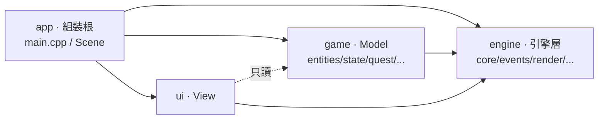

# 架構總覽

《尋傘記：政大山下篇》是一款 **C++20 + Raylib 5.5** 的俯視角敘事 RPG。原始碼採
**領域分層（domain-layered）**，`include/` 與 `src/` 兩棵樹平行鏡射，頂層切成
四個領域，相依方向單向：



## 三權分立（MVC）

整體是 **[MVC](concepts/arch-mvc.md)** 搭配每幀模擬管線：

- **Model — `World`**：純資料。擁有每個 `GameObject`、學期狀態機、碰撞遮罩、對話/HUD/
  背包狀態。**不認得 raylib、不讀輸入。**
- **View — `ui/`**：只讀 `const World&`，透過 **[`IRenderer`](concepts/arch-dip-renderer.md)**
  把畫面畫出來。所有 raylib `Draw*` 都關在 `RaylibRenderer` 後面。
- **Controller — `GameController`**：收輸入、跑 **[`ISystem` 模擬管線](concepts/arch-isystem.md)**、
  接 **[`EventBus`](concepts/pat-observer.md)** 事件、改 World。

`main.cpp` 是薄薄的組裝根（composition root）。

## 物件模型（entities）

地圖上每個東西都是一個 `GameObject`（抽象）。能力不靠胖介面，而是
**[角色介面 ISP](concepts/oo-isp-roles.md)**（`IUpdatable`/`IDrawable`/`IInteractable`/`IMortal`）
＋ **[CRTP mixin `WithRoles`](concepts/oo-crtp.md)** 在編譯期靜態判斷、無 `dynamic_cast`。

```
GameObject
├── Character ── WithRoles ── Player / NPC ── Vendor
├── Item
│   ├── TransparentUmbrella ── True / Fragile / ProfessorTrap / Cursed   (Template Method: BeClaimed)
│   ├── ConsumableItem ── EnergyDrink / HotPack / WaterproofSpray         (Template Method: Consume)
│   └── CashPickup / QuestFlagPickup
└── DlcSign
```

具體物件由 **[Factory Method](concepts/pat-factory.md)**（`GameObjectFactory`）依 `ObjectType`
列舉產生。

## 時間軸（state）

學期由 **[State 模式](concepts/pat-state.md)** 的 `SemesterStateMachine` 驅動：五個章節狀態
（加退選 → 期中 → 校慶 → 期末，中間共用 `Interlude_Market` 轉運站），四種結局
**A → B → D → C** 由 `CheckEndingGates()` 每個非對話幀輪詢，旗標一旦設立即為 TOTAL，不
soft-lock。

## 每幀怎麼跑

`GameController::Update()` 先跑 4 個輸入處理器（ending/pause/dialog/inventory，任一凍結即
return），未凍結則建 `SimContext`，依序跑管線：
**Survival → Movement → Collision → Spawn →（E 互動 / 結局判定）→ Sweep**。
互動的具體後果靠 vtable 多型（`Interact` → `BeClaimed`）＋ `EventBus` 廣播；物件不立即
delete，改標記 `isActive_=false`，由 `SweepSystem` 於幀末統一清除（**[RAII / mark-then-sweep](concepts/oo-raii.md)**）。

## 架構鐵律（紅線）

1. `Player` 不得 `#include` 任何具體 umbrella header——只認 `TransparentUmbrella*`。
2. Model 類別不得直接呼叫 raylib `Draw*`——一律經注入的 `IRenderer`，或經 `EventBus` 廣播。
3. 主迴圈不得在迭代中 `delete` GameObject——改 `isActive_=false` + 幀末 `Sweep()`。
4. `ISystem` 只動 model——不讀輸入、不呼叫 raylib、不繪圖。
5. **[harness](concepts/arch-harness.md)** 絕不改變正常遊玩行為（已驗證 bit-for-bit 不變）。

> 完整類別圖 / 狀態圖 / 循序圖見權威來源 [`docs/UML/`](../../docs/UML/README.md)。本頁只是把它們
> 與互動圖譜中的節點串起來的導覽。

---
[← wiki 索引](index.md) · [🕸 互動圖譜](https://jiangjiangian.github.io/ultraplan-sync/) · [🧬 圖譜結構](schema.md)
